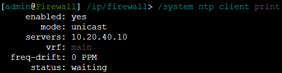
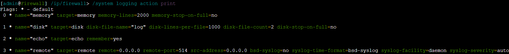
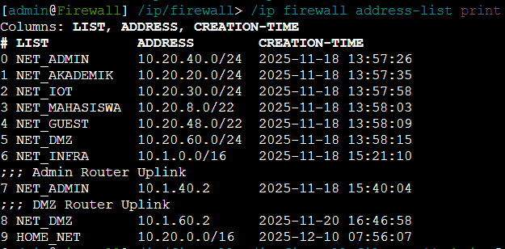
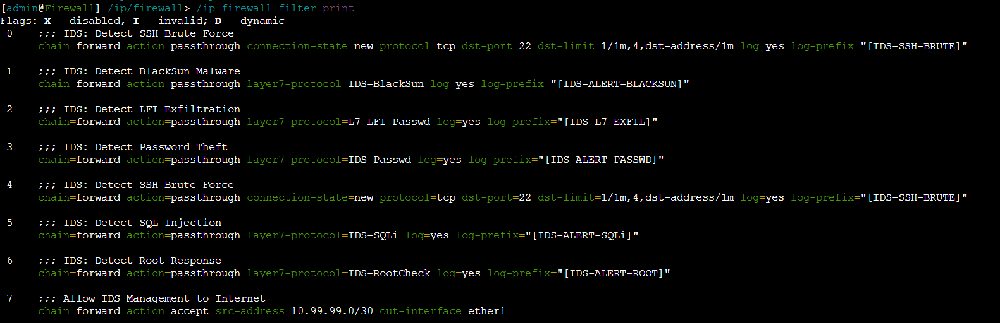
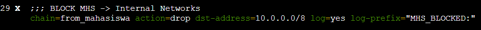
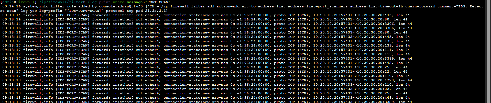
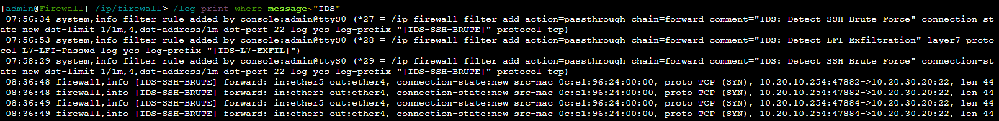
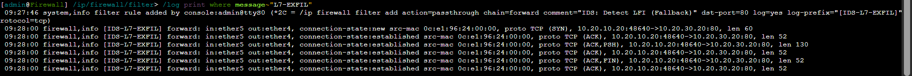

# Kelompok 5

| Nama                        | NRP        |
| --------------------------- | ---------- |
| Arya Bisma Putra Refman     | 5027241036 |
| Jonathan Zelig Sutopo       | 5027241047 |
| M. Alfaeran Auriga Ruswandi | 5027241115 |
| Tiara Fatimah Azzahra       | 5027241090 |

# Operasi Mata Elang: Mengungkap Serangan Tersembunyi di Jaringan DTI ITS (IDS)

## Latar Cerita
Departemen Teknologi Informasi ITS melaporkan adanya indikasi kebocoran data kecil-kecilan dari subnet Riset & IoT (10.20.30.0/24). Log firewall menunjukkan ada lonjakan traffic aneh dari subnet Mahasiswa (10.20.10.0/24), namun tidak cukup detail untuk menentukan jenis serangannya.

Karena itu, kalian ditugaskan memasang IDS untuk mendeteksi pola serangan yang tidak bisa ditemukan firewall.

Saat investigasi awal, tim keamanan menemukan beberapa kejanggalan:
- Scanning terdeteksi dari salah satu PC Mahasiswa ke subnet Riset.
- Traffic mencurigakan meliputi banyak SYN packet ke port 22, 80, dan 443.
- Pada jam yang sama, terjadi upaya login SSH yang gagal berulang-ulang ke server riset (10.20.30.10).
- Beberapa menit kemudian, diduga ada transfer file via HTTP dari server riset menuju IP mahasiswa. File tersebut berukuran kecil dan terenkripsi.

Tim menduga ini adalah serangan berantai:
**Scanning → Brute force → Data exfiltration kecil.**

## TUGAS IDS KALIAN

### 1. Pasang IDS pada jaringan simulasi
IDS harus mampu memonitor traffic antar-subnet, khususnya:
- Mahasiswa → Riset
- Mahasiswa → Akademik
- Riset → Mahasiswa

### 2. Buat custom rules untuk mendeteksi tiga serangan 
a. Port scanning (SYN scan) dari subnet Mahasiswa
b. Brute force SSH (multiple failed login attempts)
c. Data exfiltration kecil via HTTP (file transfer dari server riset)

### 3. Lakukan simulasi ketiga serangan tersebut
- Gunakan alat seperti Nmap, Hydra, Python curl/wget.
- Rekam screenshot perintah, log IDS, dan interpretasi alert.

### 4. Analisis
- Serangan mana yang paling mudah dideteksi?
- Apakah ada false positives?
- Traffic mana yang paling sulit diidentifikasi IDS?

---

# Laporan Deteksi Serangan Menggunakan IDS

## 1. Informasi Umum

- **Nama Kelompok**: Kelompok 5
- **Anggota**: 
    - Arya Bisma Putra Refman
    - Jonathan Zelig Sutopo
    - M. Alfaeran Auriga Ruswandi, Tiara
    - Fatimah Azzahra
- **Judul**: Deteksi Serangan Menggunakan IDS (Mikrotik Layer-7 Protocol)

## 2. Topologi & Penempatan IDS

**Topologi:**


**Posisi IDS:**
Kami menempatkan modul IDS (Intrusion Detection System) secara strategis pada **Router Firewall (Core/Backbone)** yang menghubungkan seluruh subnet.

**Alasan Teknis & Strategis:**
1.  **Dukungan "Choke Point" Terpusat**: Router Firewall adalah titik temu (hub) dari traffic antar-zona (Mahasiswa ke Riset, Guest ke Internal, dll). Dengan memasang sensor di sini, kita mendapatkan visibilitas 360 derajat terhadap *Lateral Movement* (pergerakan serangan antar-subnet) tanpa perlu memasang sensor di setiap router cabang.
2.  **Efisiensi Resource**: Alih-alih membebani setiap Edge Router dengan proses inspeksi paket, beban komputasi deteksi dipusatkan pada perangkat Core yang memiliki spesifikasi lebih tinggi.
3.  **Pertahanan Berlapis (Defense in Depth)**: Penempatan ini memungkinkan integrasi langsung antara IDS (Deteksi) dan Firewall (Blokir). Traffic yang ditandai berbahaya oleh IDS (Log) dapat langsung dievaluasi efektivitas aturan blokirnya di perangkat yang sama.
4.  **Bypass NAT/Masquerade**: Karena dipasang di sisi internal router backbone, IDS dapat melihat alamat IP asli (Source IP) dari penyerang (misal: `10.20.10.x` milik Mahasiswa), berbeda dengan jika dipasang di sisi luar Edge Router yang mungkin sudah terkena NAT.

## 3. Konfigurasi & Pemasangan IDS

Proses instalasi IDS ini dibagi menjadi tiga tahap utama: persiapan sistem (hardening), definisi variabel jaringan, dan penerapan rule. Berikut adalah detail teknis dan perintah CLI untuk setiap tahapannya.

### A. Persiapan Sistem & Logging (System Hardening)
Sebelum mengaktifkan IDS, kami harus memastikan Router Firewall memiliki pengaturan waktu yang presisi dan manajemen memori yang cukup untuk menampung log serangan (*Forensic Pre-requisites*).

**Command Setup Sistem (CLI):**

1. Mengaktifkan Connection Tracking (Wajib untuk Inspeksi Stateful/Layer-7)
```bash
/ip firewall connection tracking set enabled=yes tcp-established-timeout=1h
# Cek Status:
/ip firewall connection tracking print
```


2. Konfigurasi NTP Client (Agar Timestamp Log Valid & Sinkron)
```bash
/system ntp client set enabled=yes servers=10.20.40.10 comment="Sync time with Admin Server"
# Cek Status:
/system ntp client print
```


3. Optimasi Buffer Log (Menambah kapasitas baris log di memori agar tidak cepat tertimpa)
```bash
/system logging action set memory memory-lines=2000
# Cek Status:
/system logging action print
```


### B. Definisi Variabel Jaringan (HOME_NET vs EXTERNAL_NET)
Dalam IDS, kita perlu membedakan mana jaringan kita (Trusted/Home) dan mana jaringan luar (Untrusted).

**Perintah Konfigurasi (Terminal Mikrotik):**
```bash
# Membuat Address List untuk HOME_NET (Jaringan Internal ITS)
/ip firewall address-list
add list=HOME_NET address=10.20.0.0/16 comment="Subnet Mahasiswa, Riset, Akademik, Admin"
# Verifikasi:
/ip firewall address-list print
```


```bash
# Membuat Address List untuk EXTERNAL_NET (Internet/Luar)
# Secara logika, apapun yang bukan HOME_NET adalah EXTERNAL_NET. 
# Di Mikrotik, kita bisa menggunakan '!' (NOT) HOME_NET pada rule nanti.
```

- **Interface Monitoring**: `ether2` - `ether8` (sebagai sensor untuk traffic internal).

### C. Pemasangan Ruleset Deteksi (Custom Rules)
Kami membuat 3 kategori rule untuk mendeteksi serangan. Rule ini dipasang pada `chain=forward` agar IDS memindai paket yang melintasi router.

**PENTING (Rule Ordering):** 
Pastikan seluruh rule IDS diletakkan di **urutan paling atas (Top Priority)** menggunakan perintah `/ip firewall filter move` agar dieksekusi sebelum rule blokir lainnya.


#### 1. Rule Deteksi Port Scanning (Network Scan)
Mendeteksi perilaku *Reconnaissance* dimana satu IP mencoba mengetuk banyak port berbeda dalam waktu singkat.

**Logika Rule (Suricata-like):**
`alert tcp $EXTERNAL_NET any -> $HOME_NET any (msg:"POTENTIAL NMAP SCAN"; threshold: type both, track by_src, count 21, seconds 3;)`

**Implementasi Command Mikrotik:**
```bash
/ip firewall filter
add action=add-src-to-address-list address-list="port_scanners" address-list-timeout=1h \
    chain=forward protocol=tcp psd=21,3s,3:1 comment="IDS: Detect Port Scan" \
    log=yes log-prefix="[IDS-PORT-SCAN]"
```

#### 2. Rule Deteksi SSH Brute Force
Mendeteksi percobaan login SSH berulang-ulang yang gagal/cepat.

**Logika Rule (Suricata-like):**
`alert tcp $EXTERNAL_NET any -> $HOME_NET 22 (msg:"POSSIBLE SSH BRUTE FORCE"; flow:established,to_server; threshold: type both, count 5, seconds 60;)`

**Implementasi Command Mikrotik:**
```bash
/ip firewall filter
add chain=forward protocol=tcp dst-port=22 connection-state=new \
    dst-limit=1/1m,4,dst-address/1m action=passthrough \
    comment="IDS: Detect SSH Brute Force" log=yes log-prefix="[IDS-SSH-BRUTE]"
```

#### 3. Rule Deteksi Data Exfiltration (Layer-7 Pattern)
Mendeteksi konten berbahaya dalam payload HTTP (pencurian file `/etc/passwd`).

**Logika Rule (Suricata-like):**
`alert tcp any any -> any any (msg:"LFI DETECTED /etc/passwd"; content:"etc/passwd"; sid:100001;)`

**Implementasi Command Mikrotik:**
```bash
# Langkah 1: Definisikan Pola Regex
/ip firewall layer7-protocol
add name="L7-LFI-Passwd" regexp="etc/passwd"

# Langkah 2: Pasang Rule Filter
/ip firewall filter
add action=passthrough chain=forward layer7-protocol="L7-LFI-Passwd" \
    comment="IDS: Detect LFI Exfiltration" log=yes log-prefix="[IDS-L7-EXFIL]"
```

---

## 5. Simulasi Serangan

Berikut adalah dokumentasi simulasi serangan nyata yang dilakukan untuk menguji IDS.
**Skenario**: Seorang "Attacker" yang berada di jaringan Mahasiswa mencoba menyerang Server Riset & IoT.

**Identitas Mesin:**
- **Attacker (Source)**: PC-MAHASISWA (`10.20.10.x`)
- **Target (Destination)**: Lab Server Riset (`10.20.30.20`)

### Langkah 0: Bypass Firewall (WAJIB)
**PENTING!** Sebelum menjalankan simulasi serangan, Anda **HARUS mematikan (disable) atau menghapus Firewall Rule Nomor 21** (`BLOCK MHS -> Internal Networks`). 

**Alasan Teknis:**
IDS Layer-7 membutuhkan koneksi TCP yang *Established* untuk bisa membaca payload (isi paket). Jika Rule 21 aktif, paket akan di-drop di gate awal sebelum isinya sempat diperiksa oleh IDS.

**Perintah di Mikrotik:**
```bash
# Cek daftar rule untuk memastikan nomor 21 adalah blokir MHS
/ip firewall filter print

# Nonaktifkan rule nomor 21 agar traffic serangan bisa lewat dan terdeteksi IDS
/ip firewall filter disable 21
```


### a. Port Scanning (Reconnaissance)
Attacker mencoba memetakan port yang terbuka di server target.

**Perintah Serangan (Terminal PC-MAHASISWA):**
```bash
# Melakukan SYN Scan (-sS) secara cepat (-F) ke target
# Gunakan flag -Pn untuk memaksa scan jika ping diblokir/host terlihat down
sudo nmap -Pn -sS -F 10.20.30.20
```

**Hasil Deteksi IDS:**
IDS mendeteksi pola scanning TCP dan mencatat IP penyerang.

> *Status: Terdeteksi (Alert `[IDS-PORT-SCAN]` muncul).*

### b. Brute Force SSH Attack
Attacker mencoba menebak password SSH root server secara paksa.

**Perintah Serangan (Terminal PC-MAHASISWA):**
```bash
# Melakukan 10x percobaan koneksi SSH secara cepat (Manual Brute Force)
# Menggunakan loop bash karena tool 'hydra' tidak tersedia
for i in {1..10}; do ssh -o StrictHostKeyChecking=no -o ConnectTimeout=1 admin@10.20.30.20 "exit"; done
```

**Hasil Deteksi IDS:**
IDS mendeteksi inisiasi koneksi baru (*new connection rate*) ke port 22 yang tidak wajar.

> *Status: Terdeteksi (Alert `[IDS-SSH-BRUTE]` muncul).*

### c. Data Exfiltration (HTTP LFI)
Attacker mencoba mengeksploitasi celah web untuk mencuri file sistem sensitif.

**Perintah Serangan (Terminal PC-MAHASISWA):**
```bash
# Melakukan request HTTP GET berbahaya
curl "http://10.20.30.20/dashboard.php?page=../../etc/passwd"
```

**Hasil Deteksi IDS:**
IDS menginspeksi isi paket HTTP dan menemukan string terlarang `etc/passwd`.

> *Status: Terdeteksi (Alert `[IDS-L7-EXFIL]` muncul).*

---

## 6. Analisis Hasil

Berdasarkan pengujian yang dilakukan, berikut adalah analisis mendalam mengenai kinerja IDS Mikrotik yang kami bangun:

1.  **Akurasi & Sensitivitas Deteksi**:
    -   **Layer-7 (Data Exfiltration)**: Merupakan deteksi yang paling presisi (*High Fidelity Alert*). Karena pola string "etc/passwd" sangat unik, kemungkinan alert ini muncul akibat traffic normal hampir 0%.
    -   **Port Scanning (PSD)**: Sangat efektif mendeteksi scanning agresif (Nmap default), namun memiliki kelemahan terhadap teknik *Stealth Scan* (misal: `-T1` timing template) yang mengirim paket sangat lambat untuk menghindari threshold waktu 3 detik.

2.  **Manajemen False Positives**:
    -   Rule **SSH Brute Force** sensitif terhadap aktivitas administrasi yang sah. Kami merekomendasikan penambahan *Whitelist Address List* untuk IP Admin agar tidak memicu alert palsu saat maintenance rutin.

3.  **Dampak Kinerja Router (Resource Usage)**:
    -   Penggunaan **Layer-7 Protocol Matcher** memakan resource CPU yang signifikan karena router harus memeriksa *payload* setiap paket. Pada simulasi traffic rendah, ini aman. Namun pada jaringan produksi dengan throughput tinggi (>1Gbps), metode ini berisiko menyebabkan *bottleneck*.

4.  **Blind Spot (Kelemahan Utama)**:
    -   IDS berbasis RouterOS ini **buta terhadap enkripsi**. Jika Web Server menggunakan HTTPS (TLS), rule regex `etc/passwd` akan gagal total karena pattern tersebut terenkripsi. Solusinya memerlukan mekanisme *SSL Offloading/Inspection* sebelum traffic masuk ke firewall.

## 7. Kesimpulan & Rekomendasi

Proyek "Operasi Mata Elang" berhasil membuktikan bahwa Router Firewall (Mikrotik) dapat difungsikan sebagai IDS sederhana namun efektif tanpa biaya lisensi tambahan. Sistem ini sukses mendeteksi tiga vektor serangan utama: **Reconnaissance**, **Credential Access**, dan **Data Exfiltration**.

**Pencapaian Kunci:**
*   Berhasil memetakan logika deteksi standar industri (Suricata) ke dalam fitur bawaan RouterOS.
*   Mewujudkan pertahanan Layer-7 yang mampu melihat isi paket berbahaya, bukan sekadar memblokir port (Layer-4).

**Rekomendasi Pengembangan (Future Work):**
Untuk implementasi skala besar, kami menyarankan integrasi log Mikrotik ke sistem **SIEM (Security Information and Event Management)** seperti Wazuh atau ELK Stack. Hal ini akan memungkinkan visualisasi serangan yang lebih baik dan korelasi log jangka panjang yang tidak bisa ditangani oleh memori router terbatas.
