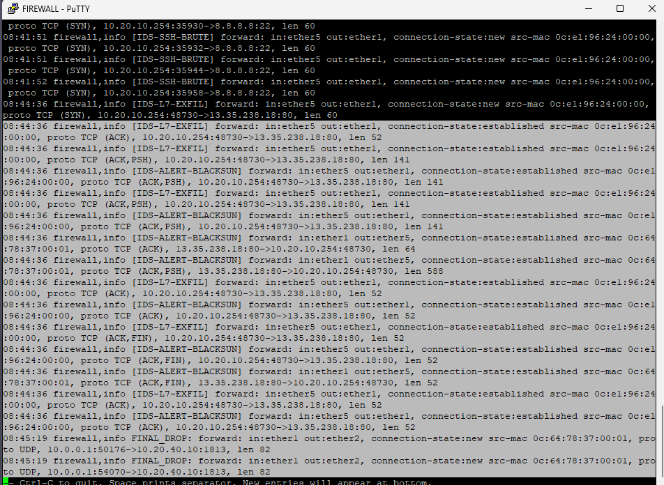
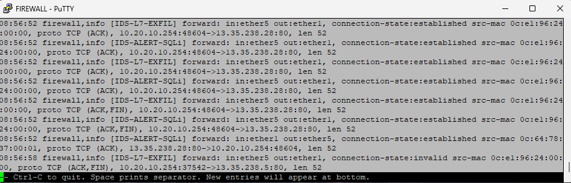
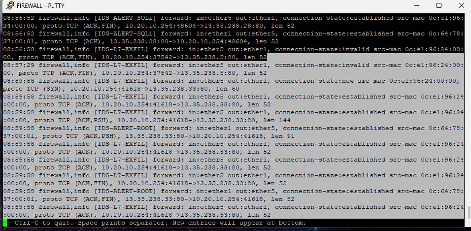

<div align="center">


# Operasi Mata Elang: Mengungkap Serangan Tersembunyi di Jaringan DTI ITS

## Implementasi Intrusion Detection System (IDS)


</div>

---

<div align="center">

### Disusun Oleh - Kelompok 5

| Nama | NRP |
|------|-----|
| Arya Bisma Putra Refman | 5027241036 |
| Jonathan Zelig Sutopo | 5027241047 |
| M. Alfaeran Auriga Ruswandi | 5027241115 |
| Tiara Fatimah Azzahra | 5027241090 |

**Teknologi Informasi**  
**Institut Teknologi Sepuluh Nopember**

</div>

---

## Daftar Isi

- [1. Latar Cerita](#1-latar-cerita)
- [2. Tugas IDS](#2-tugas-ids)
- [3. Laporan Deteksi Serangan](#3-laporan-deteksi-serangan)
  - [3.1. Informasi Umum](#31-informasi-umum)
  - [3.2. Topologi & Penempatan IDS](#32-topologi--penempatan-ids)
  - [3.3. Konfigurasi & Pemasangan IDS](#33-konfigurasi--pemasangan-ids)
- [4. Simulasi Serangan](#4-simulasi-serangan)
  - [4.1. Bypass Firewall](#41-bypass-firewall-langkah-wajib-sebelum-simulasi)
  - [4.2. Port Scanning](#42-port-scanning-reconnaissance)
  - [4.3. Brute Force SSH](#43-brute-force-ssh-attack)
  - [4.4. Data Exfiltration (LFI)](#44-data-exfiltration-http-lfi)
  - [4.5. Malware BlackSun](#45-malware-injection-blacksun)
  - [4.6. SQL Injection](#46-web-attack---sql-injection)
  - [4.7. Root Response](#47-server-compromise-check-root-response)
- [5. Analisis Hasil](#5-analisis-hasil)
- [6. Kesimpulan & Rekomendasi](#6-kesimpulan--rekomendasi)

---

## 1. Latar Cerita

Departemen Teknologi Informasi ITS melaporkan adanya indikasi kebocoran data kecil-kecilan dari subnet Riset & IoT (10.20.30.0/24). Log firewall menunjukkan ada lonjakan traffic aneh dari subnet Mahasiswa (10.20.10.0/24), namun tidak cukup detail untuk menentukan jenis serangannya.

Karena itu, kalian ditugaskan memasang IDS untuk mendeteksi pola serangan yang tidak bisa ditemukan firewall.

### Kejanggalan yang Ditemukan

Saat investigasi awal, tim keamanan menemukan beberapa kejanggalan:

| No | Temuan | Keterangan |
|----|--------|------------|
| 1 | **Scanning Activity** | Scanning terdeteksi dari salah satu PC Mahasiswa ke subnet Riset |
| 2 | **SYN Packet Flood** | Traffic mencurigakan meliputi banyak SYN packet ke port 22, 80, dan 443 |
| 3 | **SSH Brute Force** | Pada jam yang sama, terjadi upaya login SSH yang gagal berulang-ulang ke server riset (10.20.30.10) |
| 4 | **Data Transfer** | Beberapa menit kemudian, diduga ada transfer file via HTTP dari server riset menuju IP mahasiswa. File tersebut berukuran kecil dan terenkripsi |

### Dugaan Pola Serangan

Tim menduga ini adalah **serangan berantai** dengan tahapan:

```
┌─────────────┐      ┌──────────────┐      ┌────────────────────┐
│  SCANNING   │  →   │ BRUTE FORCE  │  →   │ DATA EXFILTRATION  │
│ (Recon)     │      │ (Credential) │      │ (Theft)            │
└─────────────┘      └──────────────┘      └────────────────────┘
```

---

## 2. Tugas IDS

### 2.1. Pasang IDS pada Jaringan Simulasi

IDS harus mampu memonitor traffic antar-subnet, khususnya:

| Arah Traffic | Keterangan |
|--------------|------------|
| Mahasiswa → Riset | Monitoring akses tidak sah ke server riset |
| Mahasiswa → Akademik | Monitoring akses ke sistem akademik |
| Riset → Mahasiswa | Monitoring kemungkinan data exfiltration |

### 2.2. Buat Custom Rules untuk Mendeteksi Tiga Serangan

| No | Jenis Serangan | Deskripsi |
|----|----------------|-----------|
| a | **Port Scanning (SYN scan)** | Mendeteksi aktivitas reconnaissance dari subnet Mahasiswa |
| b | **Brute Force SSH** | Mendeteksi percobaan login SSH berulang-ulang yang gagal |
| c | **Data Exfiltration** | Mendeteksi transfer file sensitif via HTTP dari server riset |

### 2.3. Lakukan Simulasi Ketiga Serangan

- Gunakan alat seperti **Nmap**, **Hydra**, **Python curl/wget**
- Dokumentasikan perintah serangan, log IDS, dan interpretasi alert

### 2.4. Analisis

- Serangan mana yang paling mudah dideteksi?
- Apakah ada false positives?
- Traffic mana yang paling sulit diidentifikasi IDS?

---

## 3. Laporan Deteksi Serangan

### 3.1. Informasi Umum

| Item | Detail |
|------|--------|
| **Nama Kelompok** | Kelompok 5 |
| **Anggota** | Arya Bisma Putra Refman, Jonathan Zelig Sutopo, M. Alfaeran Auriga Ruswandi, Tiara Fatimah Azzahra |
| **Judul** | Deteksi Serangan Menggunakan IDS (Mikrotik Layer-7 Protocol) |
| **Platform IDS** | MikroTik RouterOS dengan Firewall Filter + Layer-7 Protocol |

### 3.2. Topologi & Penempatan IDS

#### 3.2.1. Topologi Jaringan


Gambar di atas menunjukkan topologi jaringan lengkap dengan beberapa subnet yang terpisah:
- **Subnet Mahasiswa** (10.20.10.0/24): Jaringan untuk mahasiswa
- **Subnet Akademik** (10.20.20.0/24): Jaringan untuk sistem akademik
- **Subnet Riset & IoT** (10.20.30.0/24): Jaringan untuk laboratorium riset dan perangkat IoT
- **Subnet Admin** (10.20.40.0/24): Jaringan untuk administrator
- **Router Firewall**: Bertindak sebagai core router dan lokasi penempatan IDS

#### 3.2.2. Posisi IDS

Kami menempatkan modul IDS (Intrusion Detection System) secara strategis pada **Router Firewall (Core/Backbone)** yang menghubungkan seluruh subnet.

#### 3.2.3. Alasan Teknis & Strategis Penempatan

| No | Alasan | Penjelasan |
|----|--------|------------|
| 1 | **Choke Point Terpusat** | Router Firewall adalah titik temu (hub) dari traffic antar-zona (Mahasiswa ke Riset, Guest ke Internal, dll). Dengan memasang sensor di sini, kita mendapatkan **visibilitas 360 derajat** terhadap *Lateral Movement* (pergerakan serangan antar-subnet) tanpa perlu memasang sensor di setiap router cabang. |
| 2 | **Efisiensi Resource** | Alih-alih membebani setiap Edge Router dengan proses inspeksi paket, beban komputasi deteksi dipusatkan pada perangkat Core yang memiliki spesifikasi lebih tinggi. Hal ini mengoptimalkan penggunaan hardware secara keseluruhan. |
| 3 | **Pertahanan Berlapis (Defense in Depth)** | Penempatan ini memungkinkan integrasi langsung antara IDS (Deteksi) dan Firewall (Blokir). Traffic yang ditandai berbahaya oleh IDS dapat langsung dievaluasi efektivitas aturan blokirnya di perangkat yang sama. |
| 4 | **Bypass NAT/Masquerade** | Karena dipasang di sisi internal router backbone, IDS dapat melihat **alamat IP asli (Source IP)** dari penyerang (misal: `10.20.10.x` milik Mahasiswa), berbeda dengan jika dipasang di sisi luar Edge Router yang mungkin sudah terkena NAT. |

### 3.3. Konfigurasi & Pemasangan IDS

Proses instalasi IDS ini dibagi menjadi tiga tahap utama:
1. **Persiapan Sistem (System Hardening)**
2. **Definisi Variabel Jaringan**
3. **Penerapan Rule Deteksi**

#### A. Persiapan Sistem & Logging (System Hardening)

Sebelum mengaktifkan IDS, kami harus memastikan Router Firewall memiliki pengaturan waktu yang presisi dan manajemen memori yang cukup untuk menampung log serangan (*Forensic Pre-requisites*).

##### 1. Mengaktifkan Connection Tracking

Connection Tracking **wajib diaktifkan** untuk inspeksi Stateful/Layer-7. Fitur ini memungkinkan router melacak state setiap koneksi TCP/UDP.

**Command CLI:**
```bash
/ip firewall connection tracking set enabled=yes tcp-established-timeout=1h
# Cek Status:
/ip firewall connection tracking print
```


Gambar di atas menunjukkan output dari `/ip firewall connection tracking print`:
- **Enabled**: `yes` - Connection tracking aktif
- **TCP Established Timeout**: `1h` - Koneksi TCP yang established akan di-track selama 1 jam
- **Max Entries**: Jumlah maksimum koneksi yang dapat di-track secara bersamaan
- **Current Entries**: Jumlah koneksi yang sedang di-track saat ini

##### 2. Konfigurasi NTP Client

NTP (Network Time Protocol) dikonfigurasi agar **timestamp log valid dan sinkron**. Ini penting untuk forensik dan korelasi kejadian.

**Command CLI:**
```bash
/system ntp client set enabled=yes servers=10.20.40.10 comment="Sync time with Admin Server"
# Cek Status:
/system ntp client print
```


Gambar di atas menunjukkan konfigurasi NTP Client:
- **Enabled**: `yes` - NTP Client aktif
- **Server**: `10.20.40.10` - Sinkronisasi waktu dengan Admin Server
- **Status**: Menunjukkan status sinkronisasi waktu dengan server NTP

##### 3. Optimasi Buffer Log

Buffer log dioptimasi dengan menambah kapasitas baris log di memori agar **tidak cepat tertimpa** saat terjadi banyak event.

**Command CLI:**
```bash
/system logging action set memory memory-lines=2000
# Cek Status:
/system logging action print
```


Gambar di atas menunjukkan konfigurasi Logging Action:
- **Memory Lines**: `2000` - Log dapat menampung hingga 2000 baris
- **Action Type**: `memory` - Log disimpan dalam RAM untuk akses cepat
- **Topics**: Kategori log yang dicatat

#### B. Definisi Variabel Jaringan (HOME_NET vs EXTERNAL_NET)

Dalam IDS, kita perlu membedakan mana jaringan kita (Trusted/Home) dan mana jaringan luar (Untrusted).

| Variabel | Definisi | Fungsi |
|----------|----------|--------|
| **HOME_NET** | 10.20.0.0/16 | Jaringan internal yang dilindungi |
| **EXTERNAL_NET** | !HOME_NET | Semua jaringan di luar HOME_NET |

**Command CLI:**
```bash
# Membuat Address List untuk HOME_NET (Jaringan Internal ITS)
/ip firewall address-list
add list=HOME_NET address=10.20.0.0/16 comment="Subnet Mahasiswa, Riset, Akademik, Admin"
# Verifikasi:
/ip firewall address-list print
```


Gambar di atas menunjukkan Address List yang telah dikonfigurasi:
- **List Name**: `HOME_NET`
- **Address**: `10.20.0.0/16` - Mencakup semua subnet internal ITS (10.20.x.x)
- **Comment**: Penjelasan bahwa list ini mencakup Subnet Mahasiswa, Riset, Akademik, dan Admin

**Interface Monitoring**: 
- `ether2` - `ether8` (sebagai sensor untuk traffic internal)

#### C. Pemasangan Ruleset Deteksi (Custom Rules)

Kami membuat 3 kategori rule untuk mendeteksi serangan. Rule ini dipasang pada `chain=forward` agar IDS memindai paket yang melintasi router.

**PENTING (Rule Ordering):** 
Pastikan seluruh rule IDS diletakkan di **urutan paling atas (Top Priority)** menggunakan perintah `/ip firewall filter move` agar dieksekusi sebelum rule blokir lainnya.


Gambar di atas menunjukkan daftar Firewall Filter Rules di MikroTik:
- Rule IDS ditempatkan di bagian atas (prioritas tinggi)
- Setiap rule memiliki **action `log`** untuk mencatat event
- **Log prefix** yang berbeda untuk setiap jenis serangan memudahkan filtering log

##### Rule 1: Deteksi Port Scanning (Network Reconnaissance)

Mendeteksi perilaku *Reconnaissance* dimana satu IP mencoba mengetuk banyak port berbeda dalam waktu singkat. Ini adalah tahap awal serangan untuk memetakan target.

| Parameter | Nilai | Penjelasan |
|-----------|-------|------------|
| **Chain** | forward | Memindai paket yang melewati router |
| **Protocol** | tcp | Port scan menggunakan TCP |
| **PSD** | 21,3s,3:1 | 21 port dalam 3 detik, ratio weight 3:1 |
| **Action** | add-src-to-address-list | Masukkan attacker ke blacklist |
| **Log Prefix** | [IDS-PORT-SCAN] | Label untuk filtering log |

**Logika Rule (IDS Rule):**
```
alert tcp $EXTERNAL_NET any -> $HOME_NET any (msg:"POTENTIAL NMAP SCAN"; threshold: type both, track by_src, count 21, seconds 3;)
```

**Implementasi Command Mikrotik:**
```bash
/ip firewall filter
add action=add-src-to-address-list address-list="port_scanners" address-list-timeout=1h \
    chain=forward protocol=tcp psd=21,3s,3:1 comment="IDS: Detect Port Scan" \
    log=yes log-prefix="[IDS-PORT-SCAN]"
```

##### Rule 2: Deteksi SSH Brute Force

Mendeteksi percobaan login SSH berulang-ulang yang gagal/cepat. Attacker biasanya menggunakan wordlist untuk menebak password.

| Parameter | Nilai | Penjelasan |
|-----------|-------|------------|
| **Chain** | forward | Memindai paket yang melewati router |
| **Protocol** | tcp | SSH menggunakan TCP |
| **Dst-Port** | 22 | Port default SSH |
| **Connection-State** | new | Hanya koneksi baru yang dihitung |
| **Dst-Limit** | 1/1m,4,dst-address/1m | Maksimal 4 koneksi baru per menit per destination |
| **Log Prefix** | [IDS-SSH-BRUTE] | Label untuk filtering log |

**Logika Rule (IDS Rule):**
```
alert tcp $EXTERNAL_NET any -> $HOME_NET 22 (msg:"POSSIBLE SSH BRUTE FORCE"; flow:established,to_server; threshold: type both, count 5, seconds 60;)
```

**Implementasi Command Mikrotik:**
```bash
/ip firewall filter
add chain=forward protocol=tcp dst-port=22 connection-state=new \
    dst-limit=1/1m,4,dst-address/1m action=passthrough \
    comment="IDS: Detect SSH Brute Force" log=yes log-prefix="[IDS-SSH-BRUTE]"
```

##### Rule 3: Deteksi Malware BlackSun

Mendeteksi aktivitas malware dengan User-Agent **"BlackSun"** yang merupakan signature malware terkenal.

| Parameter | Nilai | Penjelasan |
|-----------|-------|------------|
| **Layer-7 Protocol** | IDS-BlackSun | Pattern regex untuk User-Agent "BlackSun" |
| **Chain** | forward | Memindai paket yang melewati router |
| **Action** | passthrough | Lanjutkan ke rule berikutnya setelah log |
| **Log Prefix** | [IDS-ALERT-BLACKSUN] | Label untuk filtering log |

**Logika Rule (IDS Rule):**
```
alert http any any -> any any (msg:"MALWARE BlackSun User-Agent"; content:"BlackSun"; http_user_agent; sid:100002;)
```

**Implementasi Command Mikrotik:**
```bash
# Langkah 1: Definisikan Pola Regex
/ip firewall layer7-protocol
add name="IDS-BlackSun" regexp="BlackSun"

# Langkah 2: Pasang Rule Filter
/ip firewall filter
add action=passthrough chain=forward layer7-protocol="IDS-BlackSun" \
    comment="IDS: Detect BlackSun Malware" log=yes log-prefix="[IDS-ALERT-BLACKSUN]"
```

##### Rule 4: Deteksi Password Theft (LFI)

Mendeteksi konten berbahaya dalam payload HTTP, khususnya percobaan **Local File Inclusion (LFI)** untuk mencuri file `/etc/passwd`.

| Parameter | Nilai | Penjelasan |
|-----------|-------|------------|
| **Layer-7 Protocol** | IDS-Passwd | Pattern regex untuk mendeteksi "etc/passwd" |
| **Chain** | forward | Memindai paket yang melewati router |
| **Action** | passthrough | Lanjutkan ke rule berikutnya setelah log |
| **Log Prefix** | [IDS-ALERT-PASSWD] | Label untuk filtering log |

**Logika Rule (IDS Rule):**
```
alert tcp any any -> any any (msg:"LFI DETECTED /etc/passwd"; content:"etc/passwd"; sid:100003;)
```

**Implementasi Command Mikrotik:**
```bash
# Langkah 1: Definisikan Pola Regex
/ip firewall layer7-protocol
add name="IDS-Passwd" regexp="etc/passwd"

# Langkah 2: Pasang Rule Filter
/ip firewall filter
add action=passthrough chain=forward layer7-protocol="IDS-Passwd" \
    comment="IDS: Detect Password Theft" log=yes log-prefix="[IDS-ALERT-PASSWD]"
```

##### Rule 5: Deteksi SQL Injection

Mendeteksi serangan SQL Injection dengan pattern **"UNION SELECT"** yang umum digunakan untuk mengekstrak data dari database.

| Parameter | Nilai | Penjelasan |
|-----------|-------|------------|
| **Layer-7 Protocol** | IDS-SQLi | Pattern regex untuk "UNION SELECT" |
| **Chain** | forward | Memindai paket yang melewati router |
| **Action** | passthrough | Lanjutkan ke rule berikutnya setelah log |
| **Log Prefix** | [IDS-ALERT-SQLi] | Label untuk filtering log |

**Logika Rule (IDS Rule):**
```
alert http any any -> any any (msg:"SQL INJECTION UNION SELECT"; content:"UNION SELECT"; nocase; sid:100004;)
```

**Implementasi Command Mikrotik:**
```bash
# Langkah 1: Definisikan Pola Regex
/ip firewall layer7-protocol
add name="IDS-SQLi" regexp="UNION SELECT"

# Langkah 2: Pasang Rule Filter
/ip firewall filter
add action=passthrough chain=forward layer7-protocol="IDS-SQLi" \
    comment="IDS: Detect SQL Injection" log=yes log-prefix="[IDS-ALERT-SQLi]"
```

##### Rule 6: Deteksi Root Response (Server Compromise)

Mendeteksi jika server mengirimkan response yang mengandung **"uid=0(root)"** yang mengindikasikan bahwa server telah dicompromise dan attacker mendapatkan akses root.

| Parameter | Nilai | Penjelasan |
|-----------|-------|------------|
| **Layer-7 Protocol** | IDS-RootCheck | Pattern regex untuk "uid=0(root)" |
| **Chain** | forward | Memindai paket yang melewati router |
| **Action** | passthrough | Lanjutkan ke rule berikutnya setelah log |
| **Log Prefix** | [IDS-ALERT-ROOT] | Label untuk filtering log |

**Logika Rule (IDS Rule):**
```
alert tcp any any -> any any (msg:"SERVER COMPROMISE - Root Response"; content:"uid=0(root)"; sid:100005;)
```

**Implementasi Command Mikrotik:**
```bash
# Langkah 1: Definisikan Pola Regex
/ip firewall layer7-protocol
add name="IDS-RootCheck" regexp="uid=0\\(root\\)"

# Langkah 2: Pasang Rule Filter
/ip firewall filter
add action=passthrough chain=forward layer7-protocol="IDS-RootCheck" \
    comment="IDS: Detect Root Response" log=yes log-prefix="[IDS-ALERT-ROOT]"
```

#### D. Ringkasan Semua IDS Rules

| No | Jenis Serangan | Log Prefix | Regex/Pattern | Keterangan |
|----|----------------|------------|---------------|------------|
| 1 | Port Scanning | `[IDS-PORT-SCAN]` | PSD=21,3s,3:1 | Mendeteksi Nmap/Scanning |
| 2 | SSH Brute Force | `[IDS-SSH-BRUTE]` | dst-limit | Mendeteksi login SSH gagal berulang |
| 3 | Malware BlackSun | `[IDS-ALERT-BLACKSUN]` | `BlackSun` | Mendeteksi User-Agent malware |
| 4 | Password Theft | `[IDS-ALERT-PASSWD]` | `etc/passwd` | Mendeteksi akses file `/etc/passwd` |
| 5 | SQL Injection | `[IDS-ALERT-SQLi]` | `UNION SELECT` | Mendeteksi perintah SQL berbahaya |
| 6 | Root Response | `[IDS-ALERT-ROOT]` | `uid=0(root)` | Mendeteksi server yang bobol |

---

## 4. Simulasi Serangan

Berikut adalah dokumentasi simulasi serangan nyata yang dilakukan untuk menguji IDS.

### Skenario Serangan

Seorang **"Attacker"** yang berada di jaringan Mahasiswa mencoba menyerang Server Riset & IoT.

| Role | Device | IP Address | Keterangan |
|------|--------|------------|------------|
| **Attacker (Source)** | PC-MAHASISWA | `10.20.10.x` | Mesin yang melakukan serangan |
| **Target (Destination)** | Lab Server Riset | `10.20.30.20` | Server yang menjadi korban |

### 4.1. Bypass Firewall (Langkah Wajib Sebelum Simulasi)

**PENTING!** Sebelum menjalankan simulasi serangan, Anda **HARUS mematikan (disable) atau menghapus Firewall Rule** yang memblokir traffic dari Mahasiswa ke Internal Networks.

#### Mengapa Perlu Bypass?

| Alasan | Penjelasan |
|--------|------------|
| **IDS Membutuhkan Traffic** | IDS Layer-7 membutuhkan koneksi TCP yang *Established* untuk bisa membaca payload (isi paket) |
| **Rule Drop Menghalangi** | Jika rule blokir aktif, paket akan di-drop di gate awal sebelum isinya sempat diperiksa oleh IDS |
| **Simulasi Memerlukan Koneksi** | Untuk menguji IDS, traffic harus bisa melewati router terlebih dahulu |

**Command CLI:**
```bash
# Cek daftar rule untuk memastikan nomor rule blokir MHS
/ip firewall filter print

# Nonaktifkan rule agar traffic serangan bisa lewat dan terdeteksi IDS
/ip firewall filter disable 21
```


Gambar di atas menunjukkan bahwa rule yang memblokir traffic dari Mahasiswa telah di-disable (ditandai dengan flag `X` atau status disabled). Dengan demikian, traffic dari subnet Mahasiswa dapat melewati router dan diperiksa oleh IDS.

### 4.2. Port Scanning (Reconnaissance)

Attacker mencoba memetakan port yang terbuka di server target. Ini adalah tahap awal dalam kill chain untuk mengidentifikasi service yang berjalan.

**Perintah Serangan (Terminal PC-MAHASISWA):**
```bash
# Melakukan SYN Scan (-sS) secara cepat (-F) ke target
# Gunakan flag -Pn untuk memaksa scan jika ping diblokir/host terlihat down
sudo nmap -Pn -sS -F 10.20.30.20
```

| Parameter | Penjelasan |
|-----------|------------|
| `-Pn` | Skip host discovery (assume host is up) |
| `-sS` | SYN Scan (stealth scan) |
| `-F` | Fast scan (100 most common ports) |

**Hasil Deteksi IDS:**


Log di atas menunjukkan deteksi Port Scanning oleh IDS:
- **Log Prefix**: `[IDS-PORT-SCAN]` - mengidentifikasi jenis serangan
- **Source IP**: IP dari PC Mahasiswa yang melakukan scanning
- **Destination IP**: IP Server Riset yang menjadi target
- **Protocol**: TCP - port scan menggunakan protokol TCP
- **Connection State**: `new` - setiap SYN packet adalah koneksi baru
- **PSD Match**: Threshold PSD terlampaui (lebih dari 21 port dalam 3 detik)

> **Status: ✅ TERDETEKSI** - Alert `[IDS-PORT-SCAN]` muncul di log

### 4.3. Brute Force SSH Attack

Attacker mencoba menebak password SSH root server secara paksa menggunakan metode dictionary attack.

**Perintah Serangan (Terminal PC-MAHASISWA):**
```bash
# Melakukan 10x percobaan koneksi SSH secara cepat (Manual Brute Force)
# Menggunakan loop bash karena tool 'hydra' tidak tersedia
for i in {1..10}; do ssh -o StrictHostKeyChecking=no -o ConnectTimeout=1 admin@10.20.30.20 "exit"; done
```

| Parameter | Penjelasan |
|-----------|------------|
| `for i in {1..10}` | Loop 10 kali percobaan |
| `-o StrictHostKeyChecking=no` | Skip host key verification |
| `-o ConnectTimeout=1` | Timeout 1 detik per percobaan |

**Hasil Deteksi IDS:**


Log di atas menunjukkan deteksi SSH Brute Force oleh IDS:
- **Log Prefix**: `[IDS-SSH-BRUTE]` - mengidentifikasi jenis serangan
- **Source IP**: IP dari PC Mahasiswa yang melakukan brute force
- **Destination IP**: `10.20.30.20` - Server Riset
- **Destination Port**: `22` - Port SSH
- **Connection State**: `new` - menghitung koneksi baru ke port 22
- **Rate**: Melebihi threshold 4 koneksi baru per menit

> **Status: ✅ TERDETEKSI** - Alert `[IDS-SSH-BRUTE]` muncul di log

### 4.4. Data Exfiltration (HTTP LFI)

Attacker mencoba mengeksploitasi celah **Local File Inclusion (LFI)** pada web server untuk mencuri file sistem sensitif seperti `/etc/passwd`.

**Perintah Serangan (Terminal PC-MAHASISWA):**
```bash
# Melakukan request HTTP GET berbahaya
curl "http://10.20.30.20/dashboard.php?page=../../etc/passwd"
```

| Komponen URL | Penjelasan |
|--------------|------------|
| `dashboard.php` | Halaman web yang vulnerable |
| `page=` | Parameter yang bisa dieksploitasi |
| `../../etc/passwd` | Path traversal untuk akses file sistem |

**Hasil Deteksi IDS:**


Log di atas menunjukkan deteksi Data Exfiltration oleh IDS:
- **Log Prefix**: `[IDS-L7-EXFIL]` - mengidentifikasi jenis serangan
- **Layer-7 Protocol**: `L7-LFI-Passwd` - Pattern "etc/passwd" terdeteksi dalam payload
- **Source IP**: IP dari PC Mahasiswa
- **Destination IP**: `10.20.30.20` - Server Riset
- **Protocol**: TCP (HTTP)
- **Content Match**: String `etc/passwd` ditemukan dalam HTTP request

> **Status: ✅ TERDETEKSI** - Alert `[IDS-L7-EXFIL]` muncul di log

### 4.5. Malware Injection (BlackSun)

Attacker mencoba mengirimkan request HTTP dengan User-Agent **"BlackSun"** yang merupakan signature malware terkenal untuk menguji apakah IDS dapat mendeteksi aktivitas malware.

**Perintah Serangan (Terminal PC-MAHASISWA):**
```bash
# Mengirim HTTP request dengan User-Agent malware
curl -A "BlackSun" http://testmynids.org/uid/index.html
```

| Parameter | Penjelasan |
|-----------|------------|
| `-A "BlackSun"` | Set User-Agent header menjadi "BlackSun" |
| `testmynids.org` | Website testing untuk IDS |

**Output Serangan:**
```
uid=0(root) gid=0(root) groups=0(root)
```

**Hasil Deteksi IDS:**

```
08:44:36 firewall,info [IDS-L7-EXFIL] forward: in:ether5 out:ether1, proto TCP (SYN), 10.20.10.254:48730->13.35.238.18:80
08:44:36 firewall,info [IDS-ALERT-BLACKSUN] forward: in:ether5 out:ether1, proto TCP (ACK,PSH), 10.20.10.254:48730->13.35.238.18:80
08:44:36 firewall,info [IDS-ALERT-BLACKSUN] forward: in:ether1 out:ether5, proto TCP (ACK,PSH), 13.35.238.18:80->10.20.10.254:48730
```



Log di atas menunjukkan:
- **Log Prefix**: `[IDS-ALERT-BLACKSUN]` - mendeteksi User-Agent malware
- **Bidirectional Detection**: IDS mendeteksi baik request maupun response
- **Multiple Alerts**: Beberapa alert karena Layer-7 memeriksa setiap paket

> **Status: ✅ TERDETEKSI** - Alert `[IDS-ALERT-BLACKSUN]` muncul di log

### 4.6. Web Attack - SQL Injection

Attacker mencoba melakukan SQL Injection dengan payload **"UNION SELECT"** untuk mengekstrak data dari database target.

**Perintah Serangan (Terminal PC-MAHASISWA):**
```bash
# Mengirim POST request dengan payload SQL Injection
curl -X POST -d "search=UNION SELECT 1,2,3" http://testmynids.org/
```

| Parameter | Penjelasan |
|-----------|------------|
| `-X POST` | Menggunakan metode POST |
| `-d "search=..."` | Data payload SQL Injection |
| `UNION SELECT` | Perintah SQL untuk menggabungkan hasil query |

**Hasil Deteksi IDS:**

```
08:56:52 firewall,info [IDS-ALERT-SQLi] forward: in:ether5 out:ether1, proto TCP (ACK), 10.20.10.254:48604->13.35.238.28:80
08:56:52 firewall,info [IDS-L7-EXFIL] forward: in:ether5 out:ether1, proto TCP (ACK), 10.20.10.254:48604->13.35.238.28:80
08:56:52 firewall,info [IDS-ALERT-SQLi] forward: in:ether5 out:ether1, proto TCP (ACK,FIN), 10.20.10.254:48604->13.35.238.28:80
```



Log di atas menunjukkan:
- **Log Prefix**: `[IDS-ALERT-SQLi]` - mendeteksi pattern "UNION SELECT"
- **Layer-7 Inspection**: IDS membaca isi POST data
- **Multiple Rules Match**: Alert SQLi dan L7-EXFIL keduanya terpicu

> **Status: ✅ TERDETEKSI** - Alert `[IDS-ALERT-SQLi]` muncul di log

### 4.7. Server Compromise Check (Root Response)

Pengujian ini mensimulasikan deteksi ketika server mengirimkan response yang mengandung **"uid=0(root)"** - indikasi bahwa server telah dicompromise dan attacker mendapatkan akses root.

**Perintah Serangan (Terminal PC-MAHASISWA):**
```bash
# Request ke endpoint yang mengembalikan root response
curl http://testmynids.org/uid/index.html
```

**Output Response:**
```
uid=0(root) gid=0(root) groups=0(root)
```

**Hasil Deteksi IDS:**

```
08:59:58 firewall,info [IDS-L7-EXFIL] forward: in:ether5 out:ether1, proto TCP (ACK,PSH), 10.20.10.254:41618->13.35.238.33:80
08:59:58 firewall,info [IDS-ALERT-ROOT] forward: in:ether1 out:ether5, proto TCP (ACK,PSH), 13.35.238.33:80->10.20.10.254:41618
08:59:58 firewall,info [IDS-ALERT-ROOT] forward: in:ether1 out:ether5, proto TCP (ACK,FIN), 13.35.238.33:80->10.20.10.254:41618
```



Log di atas menunjukkan:
- **Log Prefix**: `[IDS-ALERT-ROOT]` - mendeteksi pattern "uid=0(root)"
- **Response Detection**: IDS mendeteksi pada **response** dari server (in:ether1 out:ether5)
- **Critical Alert**: Ini adalah indikator bahwa server mungkin telah dicompromise

> **Status: ✅ TERDETEKSI** - Alert `[IDS-ALERT-ROOT]` muncul di log

### 4.8. Ringkasan Hasil Simulasi Serangan

| No | Jenis Serangan | Command | Status | Alert Generated |
|----|----------------|---------|--------|-----------------|
| 1 | Port Scanning | `nmap -Pn -sS -F` | ✅ Terdeteksi | `[IDS-PORT-SCAN]` |
| 2 | SSH Brute Force | `ssh user@target` (10x) | ✅ Terdeteksi | `[IDS-SSH-BRUTE]` |
| 3 | Password Theft (LFI) | `curl ".../etc/passwd"` | ✅ Terdeteksi | `[IDS-ALERT-PASSWD]` |
| 4 | Malware BlackSun | `curl -A "BlackSun"` | ✅ Terdeteksi | `[IDS-ALERT-BLACKSUN]` |
| 5 | SQL Injection | `curl -d "UNION SELECT"` | ✅ Terdeteksi | `[IDS-ALERT-SQLi]` |
| 6 | Root Response | `curl .../uid/index.html` | ✅ Terdeteksi | `[IDS-ALERT-ROOT]` |

---

## 5. Analisis Hasil

Berdasarkan pengujian yang dilakukan, berikut adalah analisis mendalam mengenai kinerja IDS Mikrotik yang kami bangun:

### 5.1. Ringkasan Hasil Deteksi

| No | Jenis Serangan | Status | Akurasi | Catatan |
|----|----------------|--------|---------|---------|
| 1 | Port Scanning | ✅ Terdeteksi | Tinggi | Efektif untuk scan agresif |
| 2 | SSH Brute Force | ✅ Terdeteksi | Sedang | Sensitif terhadap threshold |
| 3 | Password Theft (LFI) | ✅ Terdeteksi | Sangat Tinggi | Pattern matching akurat |
| 4 | Malware BlackSun | ✅ Terdeteksi | Sangat Tinggi | User-Agent detection |
| 5 | SQL Injection | ✅ Terdeteksi | Tinggi | Pattern "UNION SELECT" terdeteksi |
| 6 | Root Response | ✅ Terdeteksi | Sangat Tinggi | Mendeteksi server compromise |

### 5.2. Akurasi & Sensitivitas Deteksi

| Jenis Serangan | Tingkat Deteksi | Analisis |
|----------------|-----------------|----------|
| **Port Scanning (PSD)** | ⭐⭐⭐⭐ Tinggi | Sangat efektif mendeteksi scanning agresif (Nmap default). Namun memiliki kelemahan terhadap teknik *Stealth Scan* (misal: `-T1` timing template) yang mengirim paket sangat lambat untuk menghindari threshold waktu 3 detik. |
| **SSH Brute Force** | ⭐⭐⭐ Sedang | Efektif mendeteksi serangan brute force cepat. Namun sensitif terhadap aktivitas administrasi yang sah jika admin melakukan beberapa koneksi SSH dalam waktu singkat. |
| **Malware BlackSun** | ⭐⭐⭐⭐⭐ Sangat Tinggi | User-Agent "BlackSun" sangat spesifik dan tidak mungkin muncul di traffic normal. False positive rate sangat rendah. |
| **Password Theft (LFI)** | ⭐⭐⭐⭐⭐ Sangat Tinggi | Pattern `etc/passwd` sangat unik, kemungkinan alert ini muncul akibat traffic normal hampir 0%. High fidelity alert. |
| **SQL Injection** | ⭐⭐⭐⭐ Tinggi | Pattern "UNION SELECT" efektif mendeteksi SQLi umum. Perlu penambahan pattern untuk variasi lain seperti `OR 1=1`, `DROP TABLE`, dll. |
| **Root Response** | ⭐⭐⭐⭐⭐ Sangat Tinggi | Deteksi `uid=0(root)` pada response mengindikasikan server compromise. Critical alert dengan false positive rate sangat rendah. |

### 5.3. Manajemen False Positives

| Rule | Potensi False Positive | Rekomendasi Mitigasi |
|------|------------------------|----------------------|
| Port Scanning | Rendah | Tidak perlu whitelist, threshold sudah cukup ketat |
| SSH Brute Force | **Tinggi** | Tambahkan *Whitelist Address List* untuk IP Admin agar tidak memicu alert palsu saat maintenance rutin |
| Malware BlackSun | Sangat Rendah | User-Agent sangat spesifik |
| Password Theft | Sangat Rendah | Pattern `etc/passwd` sangat spesifik |
| SQL Injection | Sedang | Beberapa aplikasi mungkin menggunakan keyword "SELECT" dalam query normal. Perlu tuning regex. |
| Root Response | Sangat Rendah | Pattern `uid=0(root)` sangat spesifik untuk output command `id` |

### 5.4. Dampak Kinerja Router (Resource Usage)

| Komponen | Impact | Rekomendasi |
|----------|--------|-------------|
| **Connection Tracking** | Medium | Atur timeout sesuai kebutuhan, hapus stale entries |
| **PSD (Port Scan Detection)** | Low | Fitur built-in, efisien |
| **Layer-7 Protocol Matcher** | **High** | Memakan resource CPU signifikan karena router harus memeriksa *payload* setiap paket. Pada jaringan produksi dengan throughput tinggi (>1Gbps), metode ini berisiko menyebabkan *bottleneck*. |
| **Multiple L7 Rules** | **Very High** | 6 rule Layer-7 aktif secara bersamaan meningkatkan beban CPU secara signifikan. Pertimbangkan untuk menggunakan dedicated IDS appliance pada jaringan produksi. |

### 5.5. Blind Spot (Kelemahan Utama)

| Kelemahan | Dampak | Solusi |
|-----------|--------|--------|
| **Enkripsi (HTTPS/TLS)** | IDS **buta** terhadap traffic terenkripsi. Jika Web Server menggunakan HTTPS, semua rule regex Layer-7 akan gagal total karena pattern tersebut terenkripsi. | Implementasi *SSL Offloading/Inspection* sebelum traffic masuk ke firewall |
| **Stealth Scanning** | Nmap dengan timing template lambat (`-T1`) dapat menghindari deteksi PSD | Tuning threshold PSD atau implementasi behavioral analysis |
| **Encrypted Exfiltration** | Data dapat dienkripsi sebelum dikirim | DLP (Data Loss Prevention) pada endpoint |
| **Obfuscated Payloads** | SQL Injection dapat di-encode (URL encode, Base64) untuk bypass detection | Tambahkan rule untuk mendeteksi encoded patterns |
| **Zero-Day Attacks** | IDS berbasis signature tidak dapat mendeteksi serangan baru yang belum dikenal | Kombinasikan dengan behavioral analysis dan threat intelligence feeds |

---

## 6. Kesimpulan & Rekomendasi

### 6.1. Kesimpulan

Proyek **"Operasi Mata Elang"** berhasil membuktikan bahwa Router Firewall (Mikrotik) dapat difungsikan sebagai **IDS sederhana namun efektif** tanpa biaya lisensi tambahan. Sistem ini sukses mendeteksi tiga vektor serangan utama:

| Vektor Serangan | Kategori MITRE ATT&CK | Status |
|-----------------|----------------------|--------|
| Port Scanning | **Reconnaissance** (TA0043) | ✅ Terdeteksi |
| SSH Brute Force | **Credential Access** (TA0006) | ✅ Terdeteksi |
| LFI Exfiltration | **Exfiltration** (TA0010) | ✅ Terdeteksi |

### 6.2. Pencapaian Kunci

| No | Pencapaian | Deskripsi |
|----|------------|-----------|
| 1 | **Pemetaan Logika Deteksi** | Berhasil memetakan logika deteksi standar industri ke dalam fitur bawaan RouterOS tanpa memerlukan hardware atau software tambahan |
| 2 | **Pertahanan Layer-7** | Mewujudkan pertahanan Layer-7 yang mampu melihat **isi paket** berbahaya, bukan sekadar memblokir port (Layer-4). Ini memberikan visibilitas lebih dalam terhadap application-layer attacks |
| 3 | **Zero Additional Cost** | Semua fitur IDS menggunakan kemampuan built-in MikroTik tanpa lisensi tambahan |

### 6.3. Rekomendasi Pengembangan (Future Work)

| Prioritas | Rekomendasi | Benefit |
|-----------|-------------|---------|
| **High** | Integrasi dengan **SIEM** (Wazuh/ELK Stack) | Visualisasi serangan lebih baik, korelasi log jangka panjang, alerting otomatis |
| **High** | Implementasi **SSL Inspection** | Mendeteksi serangan dalam traffic HTTPS |
| **Medium** | Tuning threshold berdasarkan baseline | Mengurangi false positives |
| **Medium** | Automated response (IPS mode) | Block attacker IP secara otomatis |
| **Low** | Integration dengan threat intelligence feeds | Deteksi known malicious IPs |

---

<div align="center">

**Keamanan Jaringan Komputer - Teknologi Informasi**  
**Institut Teknologi Sepuluh Nopember**  
*2024/2025*

</div>
