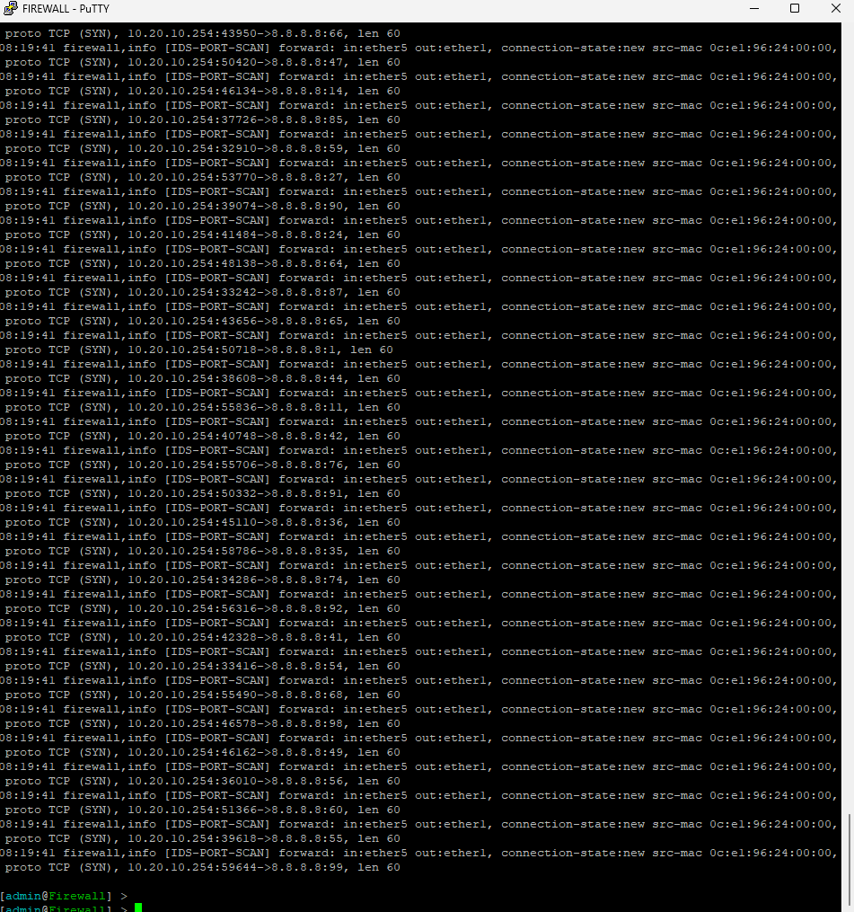
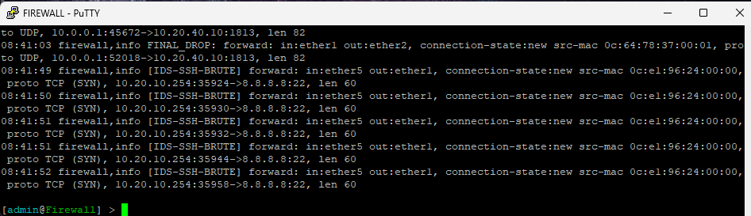
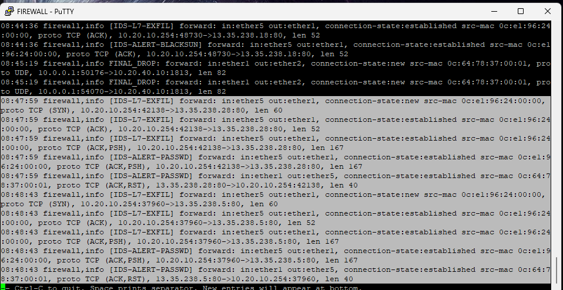

# IDS KJK 

## A. Goals to be Achieved

|                 **Goals**                 |
| :---------------------------------------: |
| Penjelasan Topologi & Penempatan IDS/IPS  |
|       Konfigurasi & Kesiapan Sistem       |
|       Custom Rules (3 rules wajib)        |
| Demo Simulasi Serangan (Live Attack Test) |
|     Pemahaman & Analisis Lisan (Q&A)      |

## B. Rules for the IDS

| **No** | **Jenis Serangan**     | **Script Konfigurasi                                                                                                  | **Keterangan**                                                                     |
| ------ | ---------------------- | --------------------------------------------------------------------------------------------------------------------- | ---------------------------------------------------------------------------------- |
| **1**  | **Port Scanning**      | `add action=add-src-to-address-list address-list=port_scanners ... comment="IDS: Detect Port Scan" ... psd=21,3s,3,1` | Mendeteksi Nmap/Scanning. Jika terdeteksi, IP pelaku masuk daftar "port_scanners". |
| **2**  | **SSH Brute Force**    | `add action=passthrough ... comment="IDS: Detect SSH Brute Force" ... dst-limit=1/1m,4... dst-port=22`                | Mendeteksi percobaan login SSH yang gagal berulang kali dalam 1 menit.             |
| **3**  | **Malware (BlackSun)** | `add action=passthrough ... comment="IDS: Detect BlackSun Malware" layer7-protocol=IDS-BlackSun ...`                  | Mendeteksi User-Agent "BlackSun" menggunakan Regex Layer 7.                        |
| **4**  | **Pencurian Password** | `add action=passthrough ... comment="IDS: Detect Password Theft" layer7-protocol=IDS-Passwd ...`                      | Mendeteksi akses ke file `/etc/passwd`.                                            |
| **5**  | **SQL Injection**      | `add action=passthrough ... comment="IDS: Detect SQL Injection" layer7-protocol=IDS-SQLi ...`                         | Mendeteksi perintah SQL berbahaya (`UNION SELECT`).                                |
| **6**  | **Root Response**      | `add action=passthrough ... comment="IDS: Detect Root Response" layer7-protocol=IDS-RootCheck ...`                    | Mendeteksi jika server memberikan respons `uid=0(root)` (tanda server bobol).      |

## C. Rules for the Firewall

### 1. Proteksi Router (Chain Input)

- Hanya Admin yang boleh remote router
  `add action=accept ... comment="Allow Admin Access (SSH/Winbox)" src-address-list=NET_ADMIN`
- Orang lain (Mahasiswa/Guest) ditolak jika mencoba masuk ke router
  `add action=drop ... comment="DROP ALL other Traffic to Firewall"`

### 2. Manajemen Alur Traffic (Chain Forward - Jumps)

- "Kalau kamu Mahasiswa, masuk ke jalur pemeriksaan Mahasiswa."
  `add action=jump ... jump-target=from_mahasiswa src-address-list=NET_MAHASISWA`
- "Kalau kamu dari DMZ, masuk ke jalur pemeriksaan DMZ."
  `add action=jump ... jump-target=from_dmz src-address-list=NET_DMZ`

### 3. Aturan Segmentasi (Specific Chains)

- **Blokir Mahasiswa:** Mencegah maahasiswa mengintip jaringan Dosen/Admin
  `add action=drop chain=from_mahasiswa comment="BLOCK MHS -> Internal Networks" ...`
- **Blokir Guest:** 
  `add action=drop chain=from_guest ... log-prefix=GUEST_BLOCK:`.
- **Izin Internet:** Membolehkan mahasiswa akses Google/Internet
  `add action=accept chain=from_mahasiswa ... out-interface=ether1
- **Akses Publik ke DMZ:** Membolehkan orang luar buka Web Kampus
  `add action=accept ... comment="Allow Public Internet to DMZ" dst-address-list=NET_DMZ dst-port=80,443...`

## D. IDS Testing

> [!note]
> Watching IDS with `/log print follow where topics~"firewall"`

### 1. Network Reconnaissance

Test it with: 

```sh
debian@PC-MAHASISWA1:~$ nmap -Pn -p 1-100 -T4 8.8.8.8
Starting Nmap 7.93 ( https://nmap.org ) at 2025-12-14 08:50 UTC
Nmap scan report for dns.google (8.8.8.8)
Host is up (0.028s latency).
Not shown: 99 filtered tcp ports (no-response)
PORT   STATE SERVICE
53/tcp open  domain
```

Here is the output result of the IDS seeing that:

```sh 
08:19:41 firewall,info [IDS-PORT-SCAN] forward: in:ether5 out:ether1, connection-state:new src-mac 0c:e1:96:24:00:00, proto TCP (SYN), 10.20.10.254:42328->8.8.8.8:41, len 60
08:19:41 firewall,info [IDS-PORT-SCAN] forward: in:ether5 out:ether1, connection-state:new src-mac 0c:e1:96:24:00:00, proto TCP (SYN), 10.20.10.254:33416->8.8.8.8:54, len 60
08:19:41 firewall,info [IDS-PORT-SCAN] forward: in:ether5 out:ether1, connection-state:new src-mac 0c:e1:96:24:00:00, proto TCP (SYN), 10.20.10.254:55490->8.8.8.8:68, len 60
08:19:41 firewall,info [IDS-PORT-SCAN] forward: in:ether5 out:ether1, connection-state:new src-mac 0c:e1:96:24:00:00, proto TCP (SYN), 10.20.10.254:46578->8.8.8.8:98, len 60
08:19:41 firewall,info [IDS-PORT-SCAN] forward: in:ether5 out:ether1, connection-state:new src-mac 0c:e1:96:24:00:00, proto TCP (SYN), 10.20.10.254:46162->8.8.8.8:49, len 60
08:19:41 firewall,info [IDS-PORT-SCAN] forward: in:ether5 out:ether1, connection-state:new src-mac 0c:e1:96:24:00:00, proto TCP (SYN), 10.20.10.254:36010->8.8.8.8:56, len 60
08:19:41 firewall,info [IDS-PORT-SCAN] forward: in:ether5 out:ether1, connection-state:new src-mac 0c:e1:96:24:00:00, proto TCP (SYN), 10.20.10.254:51366->8.8.8.8:60, len 60
08:19:41 firewall,info [IDS-PORT-SCAN] forward: in:ether5 out:ether1, connection-state:new src-mac 0c:e1:96:24:00:00, proto TCP (SYN), 10.20.10.254:39618->8.8.8.8:55, len 60
08:19:41 firewall,info [IDS-PORT-SCAN] forward: in:ether5 out:ether1, connection-state:new src-mac 0c:e1:96:24:00:00, proto TCP (SYN), 10.20.10.254:59644->8.8.8.8:99, len 60
```



### 2. Brute Force Attack (SSH)

Test it with: 

```sh
debian@PC-MAHASISWA1:~$ ssh user@8.8.8.8
^C
debian@PC-MAHASISWA1:~$ ssh user@8.8.8.8
^C
debian@PC-MAHASISWA1:~$ ssh user@8.8.8.8
^C
debian@PC-MAHASISWA1:~$ ssh user@8.8.8.8
^C
debian@PC-MAHASISWA1:~$ ssh user@8.8.8.8
^C
```

Here is the output result of the IDS seeing that:

```sh
08:41:49 firewall,info [IDS-SSH-BRUTE] forward: in:ether5 out:ether1, connection-state:new src-mac 0c:e1:96:24:00:00, proto TCP (SYN), 10.20.10.254:35924->8.8.8.8:22, len 60
08:41:50 firewall,info [IDS-SSH-BRUTE] forward: in:ether5 out:ether1, connection-state:new src-mac 0c:e1:96:24:00:00, proto TCP (SYN), 10.20.10.254:35930->8.8.8.8:22, len 60
08:41:51 firewall,info [IDS-SSH-BRUTE] forward: in:ether5 out:ether1, connection-state:new src-mac 0c:e1:96:24:00:00, proto TCP (SYN), 10.20.10.254:35932->8.8.8.8:22, len 60
08:41:51 firewall,info [IDS-SSH-BRUTE] forward: in:ether5 out:ether1, connection-state:new src-mac 0c:e1:96:24:00:00, proto TCP (SYN), 10.20.10.254:35944->8.8.8.8:22, len 60
08:41:52 firewall,info [IDS-SSH-BRUTE] forward: in:ether5 out:ether1, connection-state:new src-mac 0c:e1:96:24:00:00, proto TCP (SYN), 10.20.10.254:35958->8.8.8.8:22, len 60
```



### 3. Malware Injection (BlackSun)

Test it with: 

```sh
debian@PC-MAHASISWA1:~$ curl -A "BlackSun" http://testmynids.org/uid/index.html
uid=0(root) gid=0(root) groups=0(root)
```

Here is the output result of the IDS seeing that:

```sh
08:44:36 firewall,info [IDS-L7-EXFIL] forward: in:ether5 out:ether1, connection-state:new src-mac 0c:e1:96:24:00:00, proto TCP (SYN), 10.20.10.254:48730->13.35.238.18:80, len 60
08:44:36 firewall,info [IDS-L7-EXFIL] forward: in:ether5 out:ether1, connection-state:established src-mac 0c:e1:96:24:00:00, proto TCP (ACK), 10.20.10.254:48730->13.35.238.18:80, len 52
08:44:36 firewall,info [IDS-L7-EXFIL] forward: in:ether5 out:ether1, connection-state:established src-mac 0c:e1:96:24:00:00, proto TCP (ACK,PSH), 10.20.10.254:48730->13.35.238.18:80, len 141
08:44:36 firewall,info [IDS-ALERT-BLACKSUN] forward: in:ether5 out:ether1, connection-state:established src-mac 0c:e1:96:24:00:00, proto TCP (ACK,PSH), 10.20.10.254:48730->13.35.238.18:80, len 141
08:44:36 firewall,info [IDS-L7-EXFIL] forward: in:ether5 out:ether1, connection-state:established src-mac 0c:e1:96:24:00:00, proto TCP (ACK,PSH), 10.20.10.254:48730->13.35.238.18:80, len 141
08:44:36 firewall,info [IDS-ALERT-BLACKSUN] forward: in:ether5 out:ether1, connection-state:established src-mac 0c:e1:96:24:00:00, proto TCP (ACK,PSH), 10.20.10.254:48730->13.35.238.18:80, len 141
08:44:36 firewall,info [IDS-ALERT-BLACKSUN] forward: in:ether1 out:ether5, connection-state:established src-mac 0c:64:78:37:00:01, proto TCP (ACK), 13.35.238.18:80->10.20.10.254:48730, len 64
08:44:36 firewall,info [IDS-ALERT-BLACKSUN] forward: in:ether1 out:ether5, connection-state:established src-mac 0c:64:78:37:00:01, proto TCP (ACK,PSH), 13.35.238.18:80->10.20.10.254:48730, len 588
08:44:36 firewall,info [IDS-L7-EXFIL] forward: in:ether5 out:ether1, connection-state:established src-mac 0c:e1:96:24:00:00, proto TCP (ACK), 10.20.10.254:48730->13.35.238.18:80, len 52
08:44:36 firewall,info [IDS-ALERT-BLACKSUN] forward: in:ether5 out:ether1, connection-state:established src-mac 0c:e1:96:24:00:00, proto TCP (ACK), 10.20.10.254:48730->13.35.238.18:80, len 52
08:44:36 firewall,info [IDS-L7-EXFIL] forward: in:ether5 out:ether1, connection-state:established src-mac 0c:e1:96:24:00:00, proto TCP (ACK,FIN), 10.20.10.254:48730->13.35.238.18:80, len 52
08:44:36 firewall,info [IDS-ALERT-BLACKSUN] forward: in:ether5 out:ether1, connection-state:established src-mac 0c:e1:96:24:00:00, proto TCP (ACK,FIN), 10.20.10.254:48730->13.35.238.18:80, len 52
08:44:36 firewall,info [IDS-ALERT-BLACKSUN] forward: in:ether1 out:ether5, connection-state:established src-mac 0c:64:78:37:00:01, proto TCP (ACK,FIN), 13.35.238.18:80->10.20.10.254:48730, len 52
08:44:36 firewall,info [IDS-L7-EXFIL] forward: in:ether5 out:ether1, connection-state:established src-mac 0c:e1:96:24:00:00, proto TCP (ACK), 10.20.10.254:48730->13.35.238.18:80, len 52
08:44:36 firewall,info [IDS-ALERT-BLACKSUN] forward: in:ether5 out:ether1, connection-state:established src-mac 0c:e1:96:24:00:00, proto TCP (ACK), 10.20.10.254:48730->13.35.238.18:80, len 52
08:45:19 firewall,info FINAL_DROP: forward: in:ether1 out:ether2, connection-state:new src-mac 0c:64:78:37:00:01, proto UDP, 10.0.0.1:50176->10.20.40.10:1813, len 82
08:45:19 firewall,info FINAL_DROP: forward: in:ether1 out:ether2, connection-state:new src-mac 0c:64:78:37:00:01, proto UDP, 10.0.0.1:54070->10.20.40.10:1813, len 82
```


### 4. Web Attack - Password Theft (LFI)

Test it with:

```sh
debian@PC-MAHASISWA1:~$ curl "http://testmynids.org/index.php?file=../../../../etc/passwd"
curl: (56) Recv failure: Connection reset by peer
```

Here is the output result of the IDS seeing that:

```sh
08:51:16 firewall,info [IDS-L7-EXFIL] forward: in:ether5 out:ether1, connection-state:new src-mac 0c:e1:96:24:00:00, proto TCP (SYN), 10.20.10.254:34700->13.35.238.18:80, len 60
08:51:16 firewall,info [IDS-L7-EXFIL] forward: in:ether5 out:ether1, connection-state:established src-mac 0c:e1:96:24:00:00, proto TCP (ACK), 10.20.10.254:34700->13.35.238.18:80, len 52
08:51:16 firewall,info [IDS-L7-EXFIL] forward: in:ether5 out:ether1, connection-state:established src-mac 0c:e1:96:24:00:00, proto TCP (ACK,PSH), 10.20.10.254:34700->13.35.238.18:80, len 167
08:51:16 firewall,info [IDS-ALERT-PASSWD] forward: in:ether5 out:ether1, connection-state:established src-mac 0c:e1:96:24:00:00, proto TCP (ACK,PSH), 10.20.10.254:34700->13.35.238.18:80, len 167
08:51:16 firewall,info [IDS-ALERT-PASSWD] forward: in:ether1 out:ether5, connection-state:established src-mac 0c:64:78:37:00:01, proto TCP (ACK,RST), 13.35.238.18:80->10.20.10.254:34700, len 40
```



### 5. Web Attack - SQL Injection

Test it with: 

```sh
debian@PC-MAHASISWA1:~$ curl -X POST -d "search=UNION SELECT 1,2,3" http://testmynids.org/
<!doctype html>
<html>
    <head>
        <link rel="stylesheet" type="text/css" href="main.css" />
        <title>testmyNIDS.org | tmNIDS.sh</title>
    </head>

    <body>
        <article>
            <h1>Hey! What's up?</h1>
            <div>
                <p>This page is just a placeholder, as this website doesn't have anything worth browsing. Its purpose is explained in the project <a href="https://github.com/3CORESec/testmynids.org">Github page</a>. We do <strong>not</strong> host any illegal or malicious content.</p>
                <p>&mdash; <a href="https://twitter.com/3CORESec">@3CORESec</a></p>
            </div>
        </article>
    </body>
</html>
```

Here is the output result of the IDS seeing that:

```sh
08:56:52 firewall,info [IDS-ALERT-SQLi] forward: in:ether5 out:ether1, connection-state:established src-mac 0c:e1:96:24:00:00, proto TCP (ACK), 10.20.10.254:48604->13.35.238.28:80, len 52
08:56:52 firewall,info [IDS-L7-EXFIL] forward: in:ether5 out:ether1, connection-state:established src-mac 0c:e1:96:24:00:00, proto TCP (ACK), 10.20.10.254:48604->13.35.238.28:80, len 52
08:56:52 firewall,info [IDS-ALERT-SQLi] forward: in:ether5 out:ether1, connection-state:established src-mac 0c:e1:96:24:00:00, proto TCP (ACK), 10.20.10.254:48604->13.35.238.28:80, len 52
08:56:52 firewall,info [IDS-L7-EXFIL] forward: in:ether5 out:ether1, connection-state:established src-mac 0c:e1:96:24:00:00, proto TCP (ACK,FIN), 10.20.10.254:48604->13.35.238.28:80, len 52
08:56:52 firewall,info [IDS-ALERT-SQLi] forward: in:ether5 out:ether1, connection-state:established src-mac 0c:e1:96:24:00:00, proto TCP (ACK,FIN), 10.20.10.254:48604->13.35.238.28:80, len 52
08:56:52 firewall,info [IDS-ALERT-SQLi] forward: in:ether1 out:ether5, connection-state:established src-mac 0c:64:78:37:00:01, proto TCP (ACK), 13.35.238.28:80->10.20.10.254:48604, len 52
08:56:58 firewall,info [IDS-L7-EXFIL] forward: in:ether5 out:ether1, connection-state:invalid src-mac 0c:e1:96:24:00:00, proto TCP (ACK,FIN), 10.20.10.254:37542->13.35.238.5:80, len 52
08:57:29 firewall,info [IDS-L7-EXFIL] forward: in:ether5 out:ether1, connection-state:invalid src-mac 0c:e1:96:24:00:00, proto TCP (ACK,FIN), 10.20.10.254:37542->13.35.238.5:80, len 52
```


### 6. Server Compromise Check (Root Response)

Test it with: 

```sh
debian@PC-MAHASISWA1:~$ curl http://testmynids.org/uid/index.html
uid=0(root) gid=0(root) groups=0(root)
```

Here is the output result of the IDS seeing that:

```sh
08:57:29 firewall,info [IDS-L7-EXFIL] forward: in:ether5 out:ether1, connection-state:invalid src-mac 0c:e1:96:24:00:00, proto TCP (ACK,FIN), 10.20.10.254:37542->13.35.238.5:80, len 52
08:59:58 firewall,info [IDS-L7-EXFIL] forward: in:ether5 out:ether1, connection-state:new src-mac 0c:e1:96:24:00:00, proto TCP (SYN), 10.20.10.254:41618->13.35.238.33:80, len 60
08:59:58 firewall,info [IDS-L7-EXFIL] forward: in:ether5 out:ether1, connection-state:established src-mac 0c:e1:96:24:00:00, proto TCP (ACK), 10.20.10.254:41618->13.35.238.33:80, len 52
08:59:58 firewall,info [IDS-L7-EXFIL] forward: in:ether5 out:ether1, connection-state:established src-mac 0c:e1:96:24:00:00, proto TCP (ACK,PSH), 10.20.10.254:41618->13.35.238.33:80, len 144
08:59:58 firewall,info [IDS-ALERT-ROOT] forward: in:ether1 out:ether5, connection-state:established src-mac 0c:64:78:37:00:01, proto TCP (ACK,PSH), 13.35.238.33:80->10.20.10.254:41618, len 91
08:59:58 firewall,info [IDS-L7-EXFIL] forward: in:ether5 out:ether1, connection-state:established src-mac 0c:e1:96:24:00:00, proto TCP (ACK), 10.20.10.254:41618->13.35.238.33:80, len 52
08:59:58 firewall,info [IDS-L7-EXFIL] forward: in:ether5 out:ether1, connection-state:established src-mac 0c:e1:96:24:00:00, proto TCP (ACK), 10.20.10.254:41618->13.35.238.33:80, len 52
08:59:58 firewall,info [IDS-L7-EXFIL] forward: in:ether5 out:ether1, connection-state:established src-mac 0c:e1:96:24:00:00, proto TCP (ACK,FIN), 10.20.10.254:41618->13.35.238.33:80, len 52
08:59:58 firewall,info [IDS-ALERT-ROOT] forward: in:ether1 out:ether5, connection-state:established src-mac 0c:64:78:37:00:01, proto TCP (ACK,FIN), 13.35.238.33:80->10.20.10.254:41618, len 52
08:59:58 firewall,info [IDS-L7-EXFIL] forward: in:ether5 out:ether1, connection-state:established src-mac 0c:e1:96:24:00:00, proto TCP (ACK), 10.20.10.254:41618->13.35.238.33:80, len 52
```

