# KJK Firewall Implementation Notes

---

## A. Network Topology

Here is the network  topology for out Network Security Challenge.

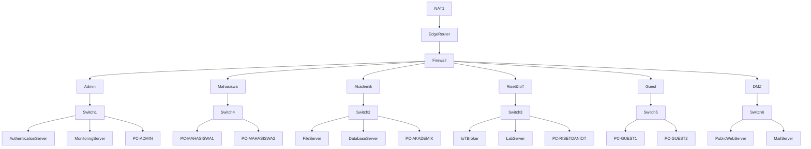

## B. Network Configuration IP Address

### 1. Router Interfaces & Gateways

| **Device Name**      | **Role**         | **Interface** | **IP Address**   | **Subnet Mask** | **Description**                   |
| -------------------- | ---------------- | ------------- | ---------------- | --------------- | --------------------------------- |
| **Edge Router**      | Internet Gateway | `ether1`      | _DHCP (Dynamic)_ | -               | Connection to Internet (GNS3 NAT) |
|                      |                  | `ether2`      | **10.0.0.1**     | /30             | Uplink to Core Firewall           |
| **Firewall**         | Core Security    | `ether1`      | **10.0.0.2**     | /30             | Uplink to Edge Router             |
|                      |                  | `ether2`      | **10.1.40.1**    | /30             | Downlink to **Admin** Router      |
|                      |                  | `ether3`      | **10.1.20.1**    | /30             | Downlink to **Akademik** Router   |
|                      |                  | `ether4`      | **10.1.30.1**    | /30             | Downlink to **Riset/IoT** Router  |
|                      |                  | `ether5`      | **10.1.10.1**    | /30             | Downlink to **Mahasiswa** Router  |
|                      |                  | `ether6`      | **10.1.50.1**    | /30             | Downlink to **Guest** Router      |
|                      |                  | `ether7`      | **10.1.60.1**    | /30             | Downlink to **DMZ** Router        |
| **Admin Router**     | Trusted Zone     | `ether1`      | **10.1.40.2**    | /30             | Uplink to Firewall                |
|                      |                  | `ether2`      | **10.20.40.1**   | /24             | **Gateway for Admin PCs**         |
| **Akademik Router**  | Staff Zone       | `ether1`      | **10.1.20.2**    | /30             | Uplink to Firewall                |
|                      |                  | `ether2`      | **10.20.20.1**   | /24             | **Gateway for Staff PCs**         |
| **Riset Router**     | IoT Zone         | `ether1`      | **10.1.30.2**    | /30             | Uplink to Firewall                |
|                      |                  | `ether2`      | **10.20.30.1**   | /24             | **Gateway for IoT Devices**       |
| **Mahasiswa Router** | Student Zone     | `ether1`      | **10.1.10.2**    | /30             | Uplink to Firewall                |
|                      |                  | `ether2`      | **10.20.10.1**   | /22             | **Gateway for Students**          |
| **Guest Router**     | Public Zone      | `ether1`      | **10.1.50.2**    | /30             | Uplink to Firewall                |
|                      |                  | `ether2`      | **10.20.50.1**   | /22             | **Gateway for Guests**            |
| **DMZ Router**       | Server Zone      | `ether1`      | **10.1.60.2**    | /30             | Uplink to Firewall                |
|                      |                  | `ether2`      | **10.20.60.1**   | /24             | **Gateway for Public Servers**    |

### 2. Client Network Summary

This table will explain the **CIDR** allocations.

| **Department**  | **Network Address** | **Prefix** | **Usable Host Range** | **Gateway IP** |     |
| --------------- | ------------------- | ---------- | --------------------- | -------------- | --- |
| **Admin**       | `10.20.40.0`        | `/24`      | `.2` to `.254`        | `10.20.40.1`   |     |
| **Akademik**    | `10.20.20.0`        | `/24`      | `.2` to `.254`        | `10.20.20.1`   |     |
| **Riset & IoT** | `10.20.30.0`        | `/24`      | `.2` to `.254`        | `10.20.30.1`   |     |
| **DMZ Servers** | `10.20.60.0`        | `/24`      | `.2` to `.254`        | `10.20.60.1`   |     |
| **Mahasiswa**   | `10.20.8.0`*        | `/22`      | `8.1` to `11.254`     | `10.20.10.1`   |     |
| **Guest**       | `10.20.48.0`*       | `/22`      | `48.1` to `51.254`    | `10.20.50.1`   |     |

*Note: For the /22 networks, the IP address `.10.1` and `.50.1` fall comfortably inside the valid range of their respective blocks.

---

## C. Network Defense Layers

### 1. Perimeter Defense (Edge Router)

**Security Function:** _Attack Surface Reduction & Obfuscation._
- **NAT (Masquerade):**
    - **Function:** It hides your entire internal structure (`10.20.x.x`) behind a single public IP.
    - **Security Value:** An attacker on the internet cannot route directly to your Admin PC or IoT devices. They can only see the Edge Router.
- **Management Plane Hardening (Input Chain):**
    - **Function:** You configured the Edge Router to **DROP** all Telnet/SSH attempts from the Internet and from Unauthorized Internal Zones (Guests/Students).
    - **Security Value:** This protects the **Integrity** of the network. Even if a student guesses your password, they cannot even get the login prompt to type it in.

### 2. Core Segmentation (Firewall)

**Security Function:** _Traffic Control & Isolation._
This is the "Brain" of your security. It implements a **Positive Security Model** (Default Drop). Instead of trying to list all "Bad" things (which is impossible), you blocked _everything_ and only listed the "Good" things.
- **Stateful Inspection:**
    - **Function:** The rule `connection-state=established,related action=accept`.
    - **Security Value:** The firewall remembers who started a conversation. If a Student asks for a website (Outbound), the firewall remembers this and automatically lets the website's reply (Inbound) come back. But if a hacker tries to _start_ a connection to the Student, it is dropped.
- **Lateral Movement Prevention:**
    - **Function:** The rule `DROP All Other Forward`.
    - **Security Value:** This prevents a compromised device in one department (e.g., a virus on a Student Laptop) from spreading to other departments (like the Admin Server). This preserves **Confidentiality**.

### 3. Zone-Based Security Policies

**Security Function:** _Least Privilege Access._
You divided the network into "Zones" based on trust levels.

| **Zone**            | **Trust Level** | **Security Policy** | **Functionality**                                                                                                                                               |
| ------------------- | --------------- | ------------------- | --------------------------------------------------------------------------------------------------------------------------------------------------------------- |
| **Admin**           | **High**        | "God Mode"          | **Availability:** Admins need to reach everywhere to fix problems.                                                                                              |
| **Akademik**        | **Medium**      | Selective Access    | **Operational Security:** Staff can pull data from IoT sensors (Riset) to do their jobs, but cannot touch Admin data (Confidentiality).                         |
| **IoT/Riset**       | **Medium**      | Selective Access    | **Functionality:** Devices can report data to servers, but are blocked from sensitive networks.                                                                 |
| **Mahasiswa/Guest** | **Zero**        | Internet Only       | **Isolation:** These are treated as "Hostile." They are granted internet access (Availability) but are strictly firewalled from the Intranet (Confidentiality). |
| **DMZ**             | **Isolated**    | Public Facing       | **Containment:** If a Web Server in the DMZ gets hacked, the hacker is trapped. They cannot use the server as a stepping stone to jump into the Admin network.  |

### 4. Resilience & Availability (DoS Defense)

**Security Function:** _Resource Protection._
- **The "Drop" Logic:**
    - **Function:** As proven in your Flood Test, the Firewall creates a hard wall.
    - **Security Value:** When the Mahasiswa network launched a Traffic Surge (DoS), the firewall absorbed the packets at the gateway level. This ensured that the **Admin Network remained Available**. The attack consumed bandwidth on the _link_, but it did not crash the _target servers_.

---

**Summary of the Network Defense Layer**

> *"The configured network ecosystem functions as a **Zero-Trust inspired architecture**. It utilizes **Network Segmentation** to isolate broadcast domains and a **Stateful Core Firewall** to enforce granular Access Control Lists (ACLs).
> 
> The system ensures **Confidentiality** by blocking unauthorized lateral movement (e.g., Student to Admin), preserves **Integrity** by hardening the management plane of network devices against internal and external tampering, and maintains **Availability** by filtering malicious traffic surges (DoS) before they reach critical servers."*

---

## D. Network Defense Layers Testing

### 1. Perimeter Defense Testing

#### a. NAT (Network Address Translation)

1. Get the Edge Router's WAN IP by running the command below on **Edge Router**

```bash
/ip address print where interface=ether1
```

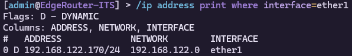

2. Generate traffic from the **Admin Router** 

```bash
ping 8.8.8.8
```

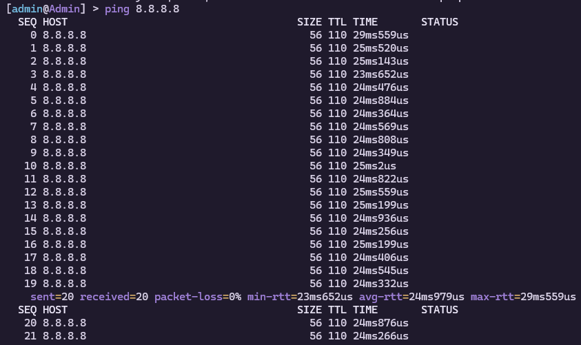

or use this instead:

```bash 
ping 8.8.8.8 src-address=10.20.40.1
```

3. Look at the Connection Table on **Edge Router**

```bash
/ip firewall connection print detail where protocol=icmp
```

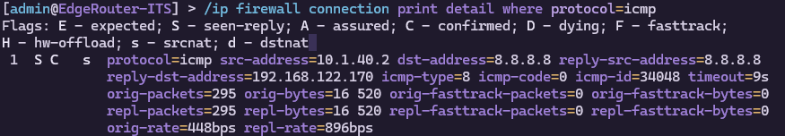

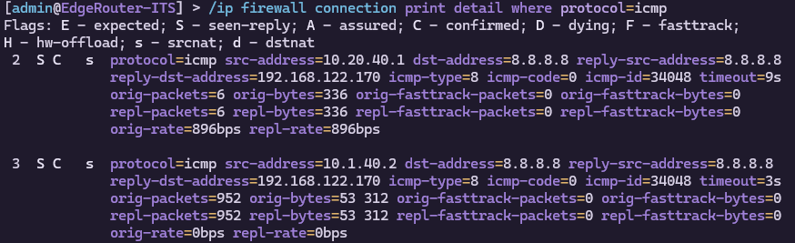

- We can know if it had worked if 

--- 

Other than the 3rd step from above, we can also use this method: 

```bash
/ip firewall nat print stats
```

- Look at the **masquerade** rule
- If the **Packets** column is **increasing** while you run the ping from the Admin Router, **NAT is working**.

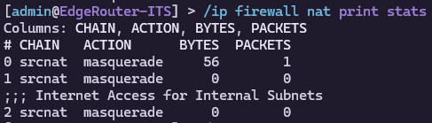

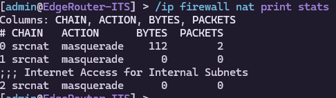

---

---

## E. Network Defense Layers Testing

### 1. Mahasiswa Service

#### a. Mahasiswa's Internet Availability

This test is to test the Mahasiswa's service if it can access the internet through the Firewall's **Rule 22** to confirm if the NAT on EdgeRouter is working or not. 

**Firewall Rule 22**

```bash
22    ;;; MHS -> Internet
      chain=from_mahasiswa action=accept out-interface=ether1
```

**Test Command**

```bash 
ping 8.8.8.8
```

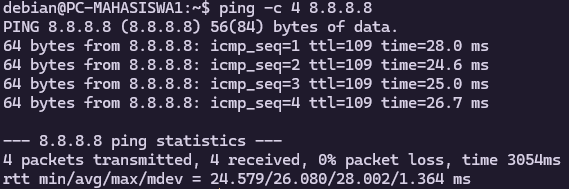

> [!NOTE]
> **Expected Result:** Ping's success means that that NAT on EdgeRouter is working properly

#### b. Mahasiswa's Internal DNS

This test is to test the Mahasiwa's service if it's DNS Resolution working properly as it is configured on Firewall's **Rule 19 & 20**.

**Firewall Rule 19 & 20**

```bash
19    ;;; MHS -> DNS (Internal)
      chain=from_mahasiswa action=accept protocol=udp dst-address=10.20.60.11 dst-port=53

20    ;;; MHS -> DNS (Internal)
      chain=from_mahasiswa action=accept protocol=tcp dst-address=10.20.60.11 dst-port=53
```

**Test Command**

```bash
nslookup google.com
```

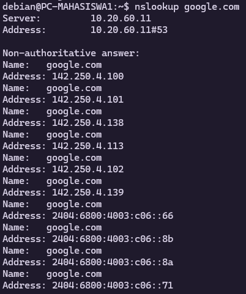

```bash
ping google.com
```

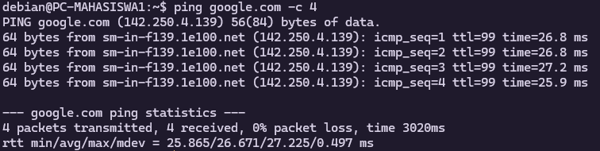

> [!note]
> **Expected Result:**  If successfully ran, it means the DNS Resolution was successful

#### c. Mahasiswa's Network Segementation 

Here the test is to verify the Firewall's **Rule 21** that blocks the Mahasiswa's access to every internal network.

```bash
21    ;;; BLOCK MHS -> Internal Networks
      chain=from_mahasiswa action=drop dst-address=10.0.0.0/8
```

> [!note]
> **Expected Result:** If the result are blocked, it verifies the **Rule 21** of the Firewall's

##### Block Access to Admin Zone

Here the Mahasiswa should NOT be able to access the Admin Zone because college students are not admins. The test are simply by pinging the Admin Router Gateway (`10.20.40.1`) and the Authentication Server (`10.20.40.10`).

```bash
ping 10.20.40.1
```

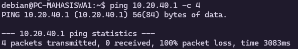

```bash
ping 10.20.40.10
```

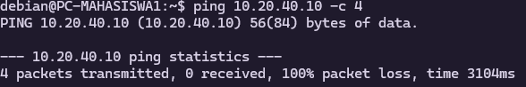

##### Block to Akademik Zone

Here the Mahasiswa should NOT be able to access the Akademik Zone because in the Akademik Zone there are important/sensitive data that is saved there, where it should be strictly protected. We can test this by simply pinging to the Akademik Gateway (`10.20.20.1`)

```bash
ping 10.20.20.1
```

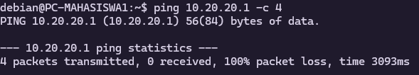

##### Block to IoT & Research Zone

Here the Mahasiswa should NOT be able to access the IoT Zone because in the IoT & Research Zone there are sensitive IoT and Research data that is being received and transmitted. We can test this by simply pinging to the IoT & Research Gateway (`10.20.30.1`)

```bash
ping 10.20.30.1
```

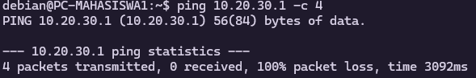

#### d. Mahasiswa's Device Hardening

The test here is to make sure that college students can't login as admin to the Mahasiswa's Service Router nor can it even slightly access the login page of the Mahasiswa's Router. The test here is simply by testing the `ssh` and the `web` service to the Mahasiswa's Router (`10.20.10.1`).

> [!note]
> **Expected Result:** the `ssh` and the `web` service here, both, should be inaccessible.

##### SSH Service

Here, by configuring the Mahasiwa Router to not open the SSH Service to other networks except for the request that comes from the Mahasiswa Router, it will be unaccessible by End Devices from the Mahasiswa's Router. 

**Test Command**

```bash
ssh admin@10.20.10.1
```

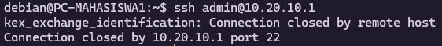

##### Web Service

For the web service itself, since the Admins doesn't need the web service, it is better to just disable the service entirely then leaving one open unattended. By disabling the whole service entirely, it will guarantee the safety of the service (since there's none accessible to begin with).

**Test Command**

```bash
curl http://10.20.10.1
```

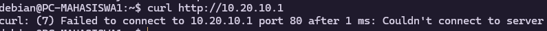

### 2. Akademik Service

#### a. Akademik's "Smart" Access

Here, from the Akademik Zone, the staffs could monitor IoT Devices in the IoT & Research Zone. This mean from the Akademik Zone, it can communicate to IoT & Research Zone.  We can test this out by pinging to the IoT & Research Zone of the Broker's Server (since we're trying to gather data from it), which has `10.20.30.10` IP Address.

**Related Firewall Rule**

```bash
17    ;;; Akademik -> IoT (Data Collection)
      chain=from_akademik action=accept dst-address-list=NET_IOT
```

**Test Command**

```bash
ping 10.20.30.10
```

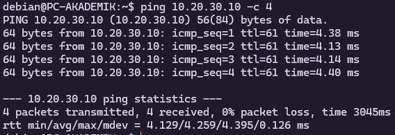

> [!note]
> **Expected Results:** This test should return successfully pinging to the Broker's server (`10.20.30.10`).  This confirms the Firewall's **Rule 17**.

#### b. Akademik's Network Segmentation

Here, the Admin should not be accessible to the Akademik staff. This can be simply tested by pinging the Admin's Gateway (`10.20.40.1`). This rule should be enforced by the Firewall's **Rule 18**.

**Related Rule**

```bash
18    ;;; DROP Akademik -> Any Internal
      chain=from_akademik action=drop dst-address=10.0.0.0/8
```

**Test Command**

```bash
ping 10.20.40.1
```

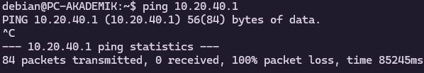

> [!note]
> **Expected Results:** Here it should be blocked to confirm Firewall's **Rule 18** is running properly.

#### c. Akademik's Lateral Movement

Here, the Akademik staff shouldn't be able to access the Mahasiswa either since it staff shouldn't be able to poke around the Mahasiswa's privacy. Here,  Firewall's **Rule 18** is the one being enforced. 

**Related Rule**

```bash
18    ;;; DROP Akademik -> Any Internal
      chain=from_akademik action=drop dst-address=10.0.0.0/8
```

**Test Command**

```bash
ping 10.20.10.1
```

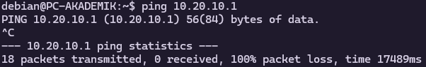

> [!note]
> **Expected Results:** Here it should be blocked to confirm Firewall's **Rule 18** is running properly as well like the previous test.

#### d. Akademik's Internet Availability

Akademik should be able to gain access to the internet like all of the other services is able to.

**Test Command**

```bash
ping 8.8.8.8
```

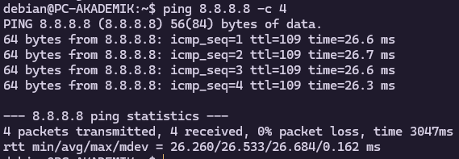

**Bonus**

```bash
ping google.com
```


> [!note]
> **Expected Result:** The result should return successful so that the Akademik's staff can be connected to the internet like any other network services.

#### e. Akademik's Device Hardening

Just like the Mahasiwa's Router, the Akademik's router should be secured so that the `web` and `ssh`service won't lead to a vulnerable access admin access to the Router. The method is also the same with how to secure the Mahasiswa's Router. This time the target will be the Akademik's Router default gateway, `10.20.20.1`

```bash
curl http://10.20.20.1
```

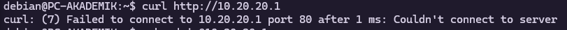

```bash
ssh admin@10.20.20.1
```

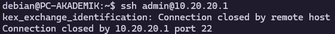

> [!note]
> **Expected Result:** Both service should be blocked from access from the End Device.

### 3. Admin Service

#### a. Admin's Internet Availability

Admin should be able to gain access to the internet like all of the other services is able to.

**Test Command**

```bash
ping 8.8.8.8
```

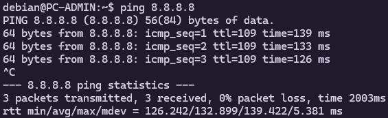

**Bonus**

```bash
ping google.com
```

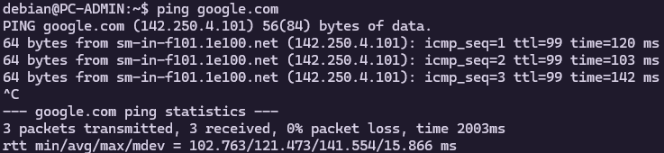

#### b. Admin's "Smart" Access

Here, from the Admin Zone, the admin could monitor all zone like Mahasiswa, Akademik, and IoT & Research Zone. This mean from the Admin Zone, it can communicate to Mahasiswa, Akademik, and IoT & Research Zone.  We can test this out by pinging to the Mahasiswa, Akademik, and IoT & Research Gateaway.

**Related Firewall Rule**

```bash
13    ;;; Admin -> ANY
      chain=from_admin action=accept
```

**Test Command**
_**Admin to Mahasiswa**_

```bash
ping 10.20.10.1
```

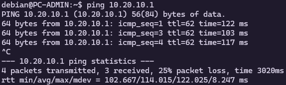

_**Admin to Akademik**_

```bash
ping 10.20.20.1
```

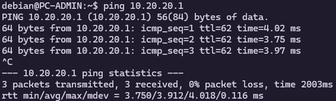

_**Admin to IoT & Research**_

```bash
ping 10.20.30.1
```


> [!note]
> **Expected Results:** This test should return successfully pinging to the Mahasiswa (`10.20.10.1`), Akademik (`10.20.20.1`), and IoT & Research (`10.20.30.10`).  This confirms the Firewall's **Rule 13**.

#### c. Admin's Device Hardening

Not like the others Router, the Admin's router should access all router because rule 13 allows the packet to travel from Admin to all router. This time the target will be the Mahasiswa's Router default gateway, `10.20.10.1`

```bash
ssh admin@10.20.10.1
```

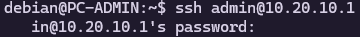
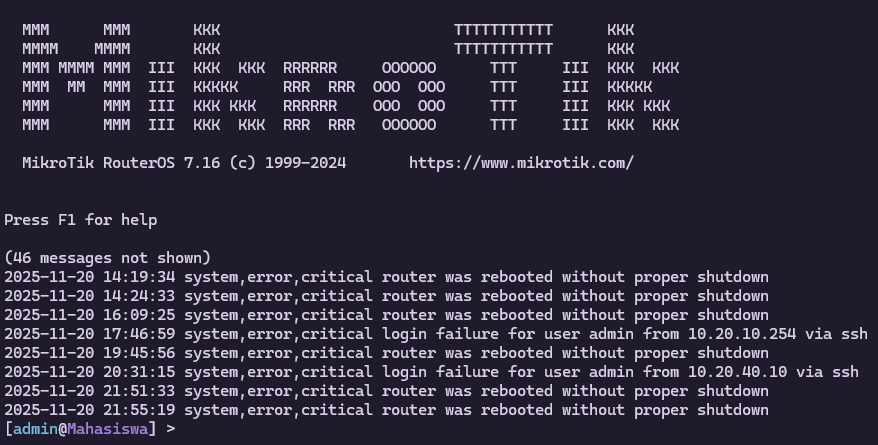

> [!note]
> **Expected Result:** ssh service should be work to access all route and End Device.

### 4. DMZ Service

#### a. DMZ's Network Segmentation

The DMZ should not be accessible to the Admin and Akamedik staff. This can be simply tested by pinging the Admin's (`10.20.40.1`) and Akademik's Gateway (`10.20.40.1`). This rule should be enforced by the Firewall's **Rule 30**.

**Related Rule**

```bash
30    ;;; DROP DMZ -> Internal (Safety Net)
      chain=from_dmz action=drop dst-address=10.0.0.0/8
```

**Test Command**
_**DMZ to Admin**_

```bash
ping 10.20.40.1
```

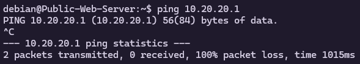

_**DMZ to Akademik**_

```bash
ping 10.20.20.1
```

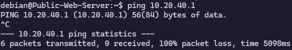

> [!note]
> **Expected Results:** Here it should be blocked to confirm Firewall's **Rule 30** is running properly.

#### b. DMZ's Internet Availability

DMZ should be able to gain access to the internet like all of the other services is able to.

**Test Command**

```bash
ping 8.8.8.8
```

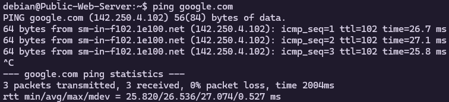

**Bonus**

```bash
ping google.com
```

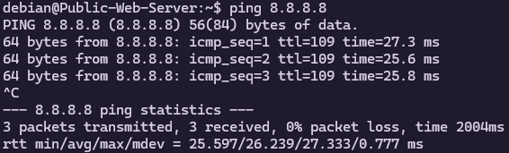

#### c. DMZ's Device Hardening

the DMZ's router should be secured so the "hacker" cannot take over the gateway. 

```bash
ssh admin@10.20.60.1
```

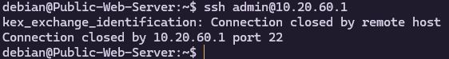]

> [!note]
> **Expected Result:** The service should be blocked. This confirms that even if your Web Server is hacked, your Router and your Internal Network remain safe.

### 5. Guest Service

#### a. Guest's Network Segmentation

The DMZ should not be accessible to the Admin, IoT & Research and Akamedik staff. This can be simply tested by pinging the Admin's (`10.20.40.1`), IoT & Research (`10.20.30.1`) Akademik's Gateway (`10.20.40.1`). This rule should be enforced by the Firewall's **Rule 24**.

**Related Rule**

```bash
24    ;;; BLOCK Guest -> Internal Networks
      chain=from_guest action=drop dst-address=10.0.0.0/8
```

**Test Command**
_**DMZ to Admin**_

```bash
ping 10.20.40.1
```

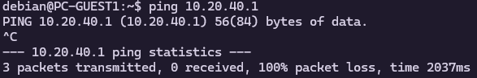

_**DMZ to IoT & Research**_

```bash
ping 10.20.30.1
```

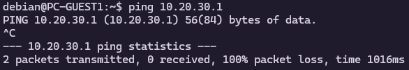

_**DMZ to Akademik**_

```bash
ping 10.20.20.1
```

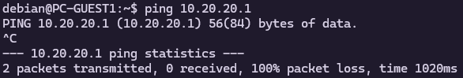

> [!note]
> **Expected Results:** Here it should be blocked to confirm Firewall's **Rule 24** is running properly.

#### b. Guest's Internet Availability

 Guest should be able to gain access to the internet like all of the other services is able to.

**Test Command**

```bash
ping 8.8.8.8
```

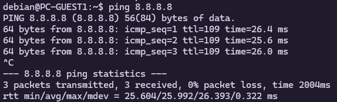

**Bonus**

```bash
ping google.com
```

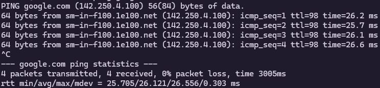

#### c. DMZ's Device Hardening

the DMZ's router should be secured because Guests are often strangers. so we definitely don't want them trying to log into the router that provides their Wi-Fi.

```bash
ssh admin@10.20.50.1
```

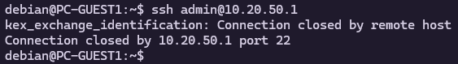]

> [!note]
> **Expected Result:** The service should be blocked because we definitely don't want them trying to log into the router that provides their Wi-Fi.

### 6. Riset & IoT Service

#### a. Riset & IoT's Internet Availability

 Riset & IoT should be able to gain access to the internet like all of the other services is able to.

**Test Command**

```bash
ping 8.8.8.8
```

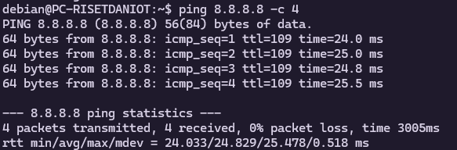

**Bonus**

```bash
ping google.com
```

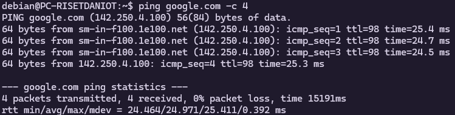

#### a. Riset & IoT's Network Segmentation

The Admin shouldn't be able to be accessed by Riset & IoT, so there woulnd't be any "infection" that can happen to Admin and the public server (DMZ) itself after Riset & IoT gets troubled. This can be simply tested by pinging the Admin's (`10.20.40.1`) and DMZ's (`10.20.60.1`) Gateway. This rule should be enforced by the Firewall's **Rule 28**.

**Related Rule**

```bash
28    ;;; DROP IoT -> All Internal
      chain=from_iot action=drop
```

**Test Command**
_**Riset & IoT to Admin**_

```bash
ping 10.20.40.1
```


_**Riset & IoT to DMZ**_

```bash
ping 10.20.60.1
```

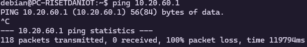

> [!note]
> **Expected Results:** Here it should be blocked to confirm Firewall's **Rule 28** is running properly.

#### c. Riset & IoT's Device Hardening

the Riset & IoT's router should be secured because the Admin are the only that is supposed to be able to change the configuration on them.

```bash
ssh admin@10.20.30.1
```

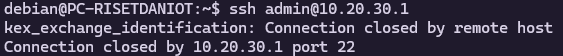

```bash
curl http://10.20.30.1
```

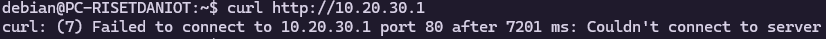

> [!note]
> **Expected Result:** The service should be blocked because we definitely don't want them trying to log into the router as an Admin that is privileged.

---

## F. Network Attack Testing

To test the effectiveness of our firewall, we need to test them out with real attacks. Here are the step-by-step attacks we're going to do: 

**Prerequisite** Attack Tools Installation

```bash 
sudo apt update && sudo apt install nmap hping3 mosquitto-clients -y
```

### Attack Scenario 1: Reconnaissance (Port Scanning)

Here the goal of the attacker is to try and map out the network to find open ports on the **Admin Router** or **File Server**. But if the Firewall is working as intended the **Rule 21 (Drop Mahasiswa --> Internal)** should silently drop these packets, making the scan incredibly slow or fail completely.

1. **Attack (Run on PC-MAHASISWA)** to try and scan the Admin Gateway for open ports (SSH, Web, DNS, etc.). 

```bash
# -Pn: Treat host as online (skip ping)
# -F: Fast scan (top 100 ports)
sudo nmap -Pn -F 10.20.40.1
```

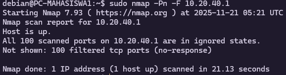

- Result: "Filtered" here means that the firewall is eating the packets. If the port were just closed (no service running), it would say "Closed". "Filtered" proves that the firewall is **active**.

### Attack 2: Denial of Service (DoS), SYN Flood

Here is the goal of the attacker is to try and overwhelm the DMZ Web Server (`10.20.60.10`) with thousand of fake connection request (SYN Packets) to make it overloaded and crash. But if the Firewall is working as intended, the **Rule 21 (Drop Mahasiswa --> Internal)**

1. **Two terminals preparation**

 Open a second terminal to monitor the logging of the firewall and then run the command below to monitor the logging system of the firewall:

```bash
/log print follow
```

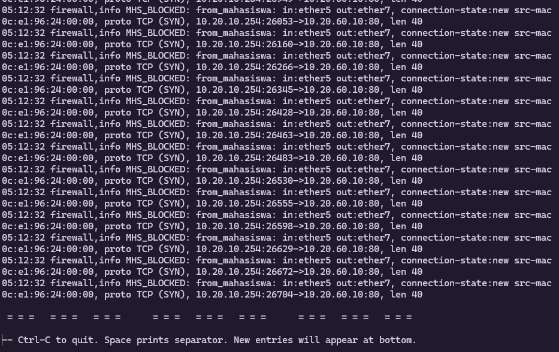

2. **Launching the Attack (Run on PC-MAHASISWA)**

```bash
# -S: Send SYN packets
# --flood: Send as fast as possible
# -p 80: Target port 80 (HTTP)
sudo hping3 -S --flood -V -p 80 10.20.60.10
```

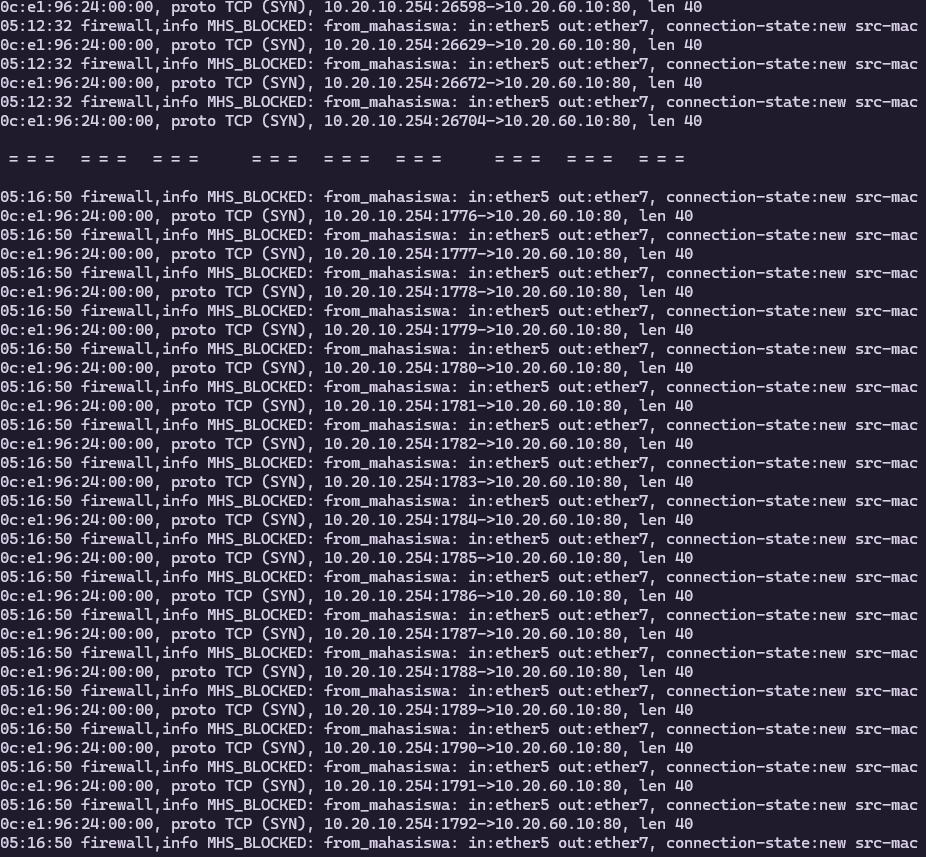

- Result: Now there it is showing a rapid stream of logs on the Firewall (`MHS_BLOCKED...`), which is the proof to show the firewall is working as intended.

### Attack Scenario 3: Brute Force Attempt (Management Plane)

The goal here is to try and brute-force the password for the Mahasiswa Router to take control of the gateway. But if the firewall is working as intended, it should reject the connection immediately. 

1. **The Attack (Run on PC-MAHASISWA)** to use the Nmap's scripting engine to simulate a brute force login check attack on SSH (port 22).

```bash
# Check if SSH accepts credentials
# -p 22: Target port
# --script ssh-brute: Use the brute force script
sudo nmap -p 22 --script ssh-brute 10.20.10.1
```

 Below is the attack result:

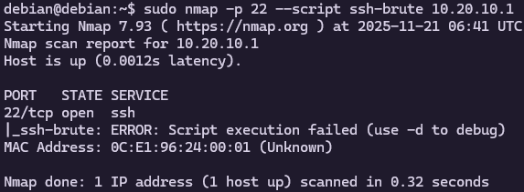

Here is when I tried running the debug (`-d`) feature to know where it is interrupted.

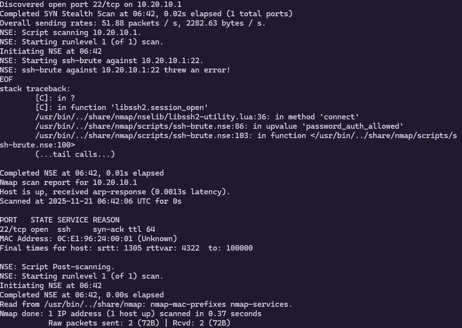

- Result: The attack immediately got brushed off, meaning that the brute-force attack didn't even get the chance to access the login form. As can be seen on the `debug`, it ran into an error when initiating a connection.

### Attack Scenario 4: MQTT Exploit 

Here the attack is about to exploit the vulnerability to gain anonymous access. But the firewall should prevent this by using the **Zero Trust Architecture (ZTA)** to not giving access to any of the anonymous actors.

1. **The Attack (Run on PC-MAHASISWA)** to use the MQTT Anonymous Login Access.

```bash 
mosquitto_sub -h 10.20.30.10 -t "#" -v
```

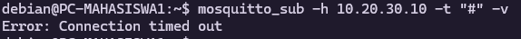
