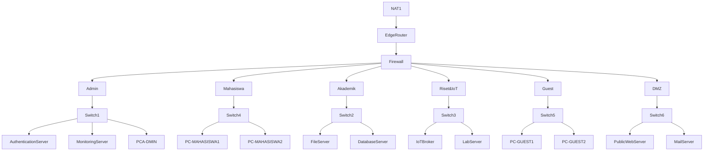

# KJK Firewall Implementation Notes

---

## A. Network Topology

Here is the network  topology for out Network Security Challenge.



## B. Network Configuration IP Address

### 1. Router Interfaces & Gateways

| **Device Name**      | **Role**         | **Interface** | **IP Address**   | **Subnet Mask** | **Description**                   |
| -------------------- | ---------------- | ------------- | ---------------- | --------------- | --------------------------------- |
| **Edge Router**      | Internet Gateway | `ether1`      | _DHCP (Dynamic)_ | -               | Connection to Internet (GNS3 NAT) |
|                      |                  | `ether2`      | **10.0.0.1**     | /30             | Uplink to Core Firewall           |
| **Firewall**         | Core Security    | `ether1`      | **10.0.0.2**     | /30             | Uplink to Edge Router             |
|                      |                  | `ether2`      | **10.1.40.1**    | /30             | Downlink to **Admin** Router      |
|                      |                  | `ether3`      | **10.1.20.1**    | /30             | Downlink to **Akademik** Router   |
|                      |                  | `ether4`      | **10.1.30.1**    | /30             | Downlink to **Riset/IoT** Router  |
|                      |                  | `ether5`      | **10.1.10.1**    | /30             | Downlink to **Mahasiswa** Router  |
|                      |                  | `ether6`      | **10.1.50.1**    | /30             | Downlink to **Guest** Router      |
|                      |                  | `ether7`      | **10.1.60.1**    | /30             | Downlink to **DMZ** Router        |
| **Admin Router**     | Trusted Zone     | `ether1`      | **10.1.40.2**    | /30             | Uplink to Firewall                |
|                      |                  | `ether2`      | **10.20.40.1**   | /24             | **Gateway for Admin PCs**         |
| **Akademik Router**  | Staff Zone       | `ether1`      | **10.1.20.2**    | /30             | Uplink to Firewall                |
|                      |                  | `ether2`      | **10.20.20.1**   | /24             | **Gateway for Staff PCs**         |
| **Riset Router**     | IoT Zone         | `ether1`      | **10.1.30.2**    | /30             | Uplink to Firewall                |
|                      |                  | `ether2`      | **10.20.30.1**   | /24             | **Gateway for IoT Devices**       |
| **Mahasiswa Router** | Student Zone     | `ether1`      | **10.1.10.2**    | /30             | Uplink to Firewall                |
|                      |                  | `ether2`      | **10.20.10.1**   | /22             | **Gateway for Students**          |
| **Guest Router**     | Public Zone      | `ether1`      | **10.1.50.2**    | /30             | Uplink to Firewall                |
|                      |                  | `ether2`      | **10.20.50.1**   | /22             | **Gateway for Guests**            |
| **DMZ Router**       | Server Zone      | `ether1`      | **10.1.60.2**    | /30             | Uplink to Firewall                |
|                      |                  | `ether2`      | **10.20.60.1**   | /24             | **Gateway for Public Servers**    |

### 2. Client Network Summary

This table will explain the **CIDR** allocations.

| **Department**  | **Network Address** | **Prefix** | **Usable Host Range** | **Gateway IP** |     |
| --------------- | ------------------- | ---------- | --------------------- | -------------- | --- |
| **Admin**       | `10.20.40.0`        | `/24`      | `.2` to `.254`        | `10.20.40.1`   |     |
| **Akademik**    | `10.20.20.0`        | `/24`      | `.2` to `.254`        | `10.20.20.1`   |     |
| **Riset & IoT** | `10.20.30.0`        | `/24`      | `.2` to `.254`        | `10.20.30.1`   |     |
| **DMZ Servers** | `10.20.60.0`        | `/24`      | `.2` to `.254`        | `10.20.60.1`   |     |
| **Mahasiswa**   | `10.20.8.0`*        | `/22`      | `8.1` to `11.254`     | `10.20.10.1`   |     |
| **Guest**       | `10.20.48.0`*       | `/22`      | `48.1` to `51.254`    | `10.20.50.1`   |     |

*Note: For the /22 networks, the IP address `.10.1` and `.50.1` fall comfortably inside the valid range of their respective blocks.

---

## C. Network Defense Layers

### 1. Perimeter Defense (Edge Router)

**Security Function:** _Attack Surface Reduction & Obfuscation._
- **NAT (Masquerade):**
    - **Function:** It hides your entire internal structure (`10.20.x.x`) behind a single public IP.
    - **Security Value:** An attacker on the internet cannot route directly to your Admin PC or IoT devices. They can only see the Edge Router.
- **Management Plane Hardening (Input Chain):**
    - **Function:** You configured the Edge Router to **DROP** all Telnet/SSH attempts from the Internet and from Unauthorized Internal Zones (Guests/Students).
    - **Security Value:** This protects the **Integrity** of the network. Even if a student guesses your password, they cannot even get the login prompt to type it in.

### 2. Core Segmentation (Firewall)

**Security Function:** _Traffic Control & Isolation._
This is the "Brain" of your security. It implements a **Positive Security Model** (Default Drop). Instead of trying to list all "Bad" things (which is impossible), you blocked _everything_ and only listed the "Good" things.
- **Stateful Inspection:**
    - **Function:** The rule `connection-state=established,related action=accept`.
    - **Security Value:** The firewall remembers who started a conversation. If a Student asks for a website (Outbound), the firewall remembers this and automatically lets the website's reply (Inbound) come back. But if a hacker tries to _start_ a connection to the Student, it is dropped.
- **Lateral Movement Prevention:**
    - **Function:** The rule `DROP All Other Forward`.
    - **Security Value:** This prevents a compromised device in one department (e.g., a virus on a Student Laptop) from spreading to other departments (like the Admin Server). This preserves **Confidentiality**.

### 3. Zone-Based Security Policies

**Security Function:** _Least Privilege Access._
You divided the network into "Zones" based on trust levels.

| **Zone**            | **Trust Level** | **Security Policy** | **Functionality**                                                                                                                                               |
| ------------------- | --------------- | ------------------- | --------------------------------------------------------------------------------------------------------------------------------------------------------------- |
| **Admin**           | **High**        | "God Mode"          | **Availability:** Admins need to reach everywhere to fix problems.                                                                                              |
| **Akademik**        | **Medium**      | Selective Access    | **Operational Security:** Staff can pull data from IoT sensors (Riset) to do their jobs, but cannot touch Admin data (Confidentiality).                         |
| **IoT/Riset**       | **Medium**      | Selective Access    | **Functionality:** Devices can report data to servers, but are blocked from sensitive networks.                                                                 |
| **Mahasiswa/Guest** | **Zero**        | Internet Only       | **Isolation:** These are treated as "Hostile." They are granted internet access (Availability) but are strictly firewalled from the Intranet (Confidentiality). |
| **DMZ**             | **Isolated**    | Public Facing       | **Containment:** If a Web Server in the DMZ gets hacked, the hacker is trapped. They cannot use the server as a stepping stone to jump into the Admin network.  |

### 4. Resilience & Availability (DoS Defense)

**Security Function:** _Resource Protection._
- **The "Drop" Logic:**
    - **Function:** As proven in your Flood Test, the Firewall creates a hard wall.
    - **Security Value:** When the Mahasiswa network launched a Traffic Surge (DoS), the firewall absorbed the packets at the gateway level. This ensured that the **Admin Network remained Available**. The attack consumed bandwidth on the _link_, but it did not crash the _target servers_.

---

**Summary of the Network Defense Layer**

> *"The configured network ecosystem functions as a **Zero-Trust inspired architecture**. It utilizes **Network Segmentation** to isolate broadcast domains and a **Stateful Core Firewall** to enforce granular Access Control Lists (ACLs).
> 
> The system ensures **Confidentiality** by blocking unauthorized lateral movement (e.g., Student to Admin), preserves **Integrity** by hardening the management plane of network devices against internal and external tampering, and maintains **Availability** by filtering malicious traffic surges (DoS) before they reach critical servers."*

---

## D. Network Defense Layers Testing

### 1. Perimeter Defense Testing

#### a. NAT (Network Address Translation)

1. Get the Edge Router's WAN IP by running the command below on **Edge Router**

```bash
/ip address print where interface=ether1
```


2. Generate traffic from the **Admin Router** 

```bash
ping 8.8.8.8
```


or use this instead:

```bash 
ping 8.8.8.8 src-address=10.20.40.1
```

3. Look at the Connection Table on **Edge Router**

```bash
/ip firewall connection print detail where protocol=icmp
```


- We can know if it had worked if 

--- 

Other than the 3rd step from above, we can also use this method: 

```bash
/ip firewall nat print stats
```

- Look at the **masquerade** rule
- If the **Packets** column is **increasing** while you run the ping from the Admin Router, **NAT is working**.


---

## E. Firewall Configurations & Testing

### 1. Firewall Rules 

### 2. Firewall Testing

#### a. IoT & Riset

1. **Testing Ping Rate Limit**

```bash
ping 10.20.20.1 src-address=10.20.30.1 size=1200 count=100 interval=0.05
```

- **Attack Speed:** 20 pps.
- **Limit:** 5 pps.
- **Result:** **Heavy Loss (~75%)**.

#### b. Akademik

1. Testing Ping Rate Limit

```bash 
ping 10.20.30.1 src-address=10.20.20.1 size=1200 count=100 interval=0.05
```

- **Attack Speed:** 20 pps.
- **Limit:** 15 pps.
- **Result:** **Light/No Loss (~0-25%)**.

#### c. Admin

1. Testing Ping Rate Limit

```bash
ping 10.20.20.1 src-address=10.20.40.1 size=1200 count=100 interval=0.05
```

- **Attack Speed:** 20 pps.
- **Limit:** None.
- **Result:** **0% Loss**

## F. Network Defense Layers Testing

### 1. Mahasiswa Service

#### a. Mahasiswa's Internet Availability

This test is to test the Mahasiswa's service if it can access the internet through the Firewall's **Rule 22** to confirm if the NAT on EdgeRouter is working or not. 

**Firewall Rule 22**

```bash
22    ;;; MHS -> Internet
      chain=from_mahasiswa action=accept out-interface=ether1
```

**Test Command**

```bash 
ping 8.8.8.8
```


> [!NOTE]
> **Expected Result:** Ping's success means that that NAT on EdgeRouter is working properly

#### b. Mahasiswa's Internal DNS

This test is to test the Mahasiwa's service if it's DNS Resolution working properly as it is configured on Firewall's **Rule 19 & 20**.

**Firewall Rule 19 & 20**

```bash
19    ;;; MHS -> DNS (Internal)
      chain=from_mahasiswa action=accept protocol=udp dst-address=10.20.60.11 dst-port=53

20    ;;; MHS -> DNS (Internal)
      chain=from_mahasiswa action=accept protocol=tcp dst-address=10.20.60.11 dst-port=53
```

**Test Command**

```bash
nslookup google.com
```


```bash
ping google.com
```


> [!note]
> **Expected Result:**  If successfully ran, it means the DNS Resolution was successful

#### c. Mahasiswa's Network Segementation 

Here the test is to verify the Firewall's **Rule 21** that blocks the Mahasiswa's access to every internal network.

```bash
21    ;;; BLOCK MHS -> Internal Networks
      chain=from_mahasiswa action=drop dst-address=10.0.0.0/8
```

> [!note]
> **Expected Result:** If the result are blocked, it verifies the **Rule 21** of the Firewall's

##### Block Access to Admin Zone

Here the Mahasiswa should NOT be able to access the Admin Zone because college students are not admins. The test are simply by pinging the Admin Router Gateway (`10.20.40.1`) and the Authentication Server (`10.20.40.10`).

```bash
ping 10.20.40.1
```


```bash
ping 10.20.40.10
```


##### Block to Akademik Zone

Here the Mahasiswa should NOT be able to access the Akademik Zone because in the Akademik Zone there are important/sensitive data that is saved there, where it should be strictly protected. We can test this by simply pinging to the Akademik Gateway (`10.20.20.1`)

```bash
ping 10.20.20.1
```


##### Block to IoT & Research Zone

Here the Mahasiswa should NOT be able to access the IoT Zone because in the IoT & Research Zone there are sensitive IoT and Research data that is being received and transmitted. We can test this by simply pinging to the IoT & Research Gateway (`10.20.30.1`)

```bash
ping 10.20.30.1
```


#### d. Mahasiswa's Device Hardening

The test here is to make sure that college students can't login as admin to the Mahasiswa's Service Router nor can it even slightly access the login page of the Mahasiswa's Router. The test here is simply by testing the `ssh` and the `web` service to the Mahasiswa's Router (`10.20.10.1`).

> [!note]
> **Expected Result:** the `ssh` and the `web` service here, both, should be inaccessible.

##### SSH Service

Here, by configuring the Mahasiwa Router to not open the SSH Service to other networks except for the request that comes from the Mahasiswa Router, it will be unaccessible by End Devices from the Mahasiswa's Router. 

**Test Command**

```bash
ssh admin@10.20.10.1
```


##### Web Service

For the web service itself, since the Admins doesn't need the web service, it is better to just disable the service entirely then leaving one open unattended. By disabling the whole service entirely, it will guarantee the safety of the service (since there's none accessible to begin with).

**Test Command**

```bash
curl http://10.20.10.1
```


### 2. Akademik Service

#### a. Akademik's "Smart" Access

Here, from the Akademik Zone, the staffs could monitor IoT Devices in the IoT & Research Zone. This mean from the Akademik Zone, it can communicate to IoT & Research Zone.  We can test this out by pinging to the IoT & Research Zone of the Broker's Server (since we're trying to gather data from it), which has `10.20.30.10` IP Address.

**Related Firewall Rule**

```bash
17    ;;; Akademik -> IoT (Data Collection)
      chain=from_akademik action=accept dst-address-list=NET_IOT
```

**Test Command**

```bash
ping 10.20.30.10
```


> [!note]
> **Expected Results:** This test should return successfully pinging to the Broker's server (`10.20.30.10`).  This confirms the Firewall's **Rule 17**.

#### b. Akademik's Network Segmentation

Here, the Admin should not be accessible to the Akademik staff. This can be simply tested by pinging the Admin's Gateway (`10.20.40.1`). This rule should be enforced by the Firewall's **Rule 18**.

**Related Rule**

```bash
18    ;;; DROP Akademik -> Any Internal
      chain=from_akademik action=drop dst-address=10.0.0.0/8
```

**Test Command**

```bash
ping 10.20.40.1
```


> [!note]
> **Expected Results:** Here it should be blocked to confirm Firewall's **Rule 18** is running properly.

#### c. Akademik's Lateral Movement

Here, the Akademik staff shouldn't be able to access the Mahasiswa either since it staff shouldn't be able to poke around the Mahasiswa's privacy. Here,  Firewall's **Rule 18** is the one being enforced. 

**Related Rule**

```bash
18    ;;; DROP Akademik -> Any Internal
      chain=from_akademik action=drop dst-address=10.0.0.0/8
```

**Test Command**

```bash
ping 10.20.10.1
```


> [!note]
> **Expected Results:** Here it should be blocked to confirm Firewall's **Rule 18** is running properly as well like the previous test.

#### d. Akademik's Internet Availability

Akademik should be able to gain access to the internet like all of the other services is able to.

**Test Command**

```bash
ping 8.8.8.8
```


**Bonus**

```bash
ping google.com
```


> [!note]
> **Expected Result:** The result should return successful so that the Akademik's staff can be connected to the internet like any other network services.

#### e. Akademik's Device Hardening

Just like the Mahasiwa's Router, the Akademik's router should be secured so that the `web` and `ssh`service won't lead to a vulnerable access admin access to the Router. The method is also the same with how to secure the Mahasiswa's Router. This time the target will be the Akademik's Router default gateway, `10.20.20.1`

```bash
curl http://10.20.20.1
```


```bash
ssh admin@10.20.20.1
```


> [!note]
> **Expected Result:** Both service should be blocked from access from the End Device.

### 3. Admin Service

#### a. Admin's Internet Availability

Admin should be able to gain access to the internet like all of the other services is able to.

**Test Command**

```bash
ping 8.8.8.8
```


**Bonus**

```bash
ping google.com
```


#### a. Admin's "Smart" Access

Here, from the Akademik Zone, the staffs could monitor IoT Devices in the IoT & Research Zone. This mean from the Akademik Zone, it can communicate to IoT & Research Zone.  We can test this out by pinging to the IoT & Research Zone of the Broker's Server (since we're trying to gather data from it), which has `10.20.30.10` IP Address.

**Related Firewall Rule**

```bash
17    ;;; Akademik -> IoT (Data Collection)
      chain=from_akademik action=accept dst-address-list=NET_IOT
```

**Test Command**

```bash
ping 10.20.30.10
```


> [!note]
> **Expected Results:** This test should return successfully pinging to the Broker's server (`10.20.30.10`).  This confirms the Firewall's **Rule 17**.

#### b. Akademik's Network Segmentation

Here, the Admin should not be accessible to the Akademik staff. This can be simply tested by pinging the Admin's Gateway (`10.20.40.1`). This rule should be enforced by the Firewall's **Rule 18**.

**Related Rule**

```bash
18    ;;; DROP Akademik -> Any Internal
      chain=from_akademik action=drop dst-address=10.0.0.0/8
```

**Test Command**

```bash
ping 10.20.40.1
```


> [!note]
> **Expected Results:** Here it should be blocked to confirm Firewall's **Rule 18** is running properly.

#### c. Akademik's Lateral Movement

Here, the Akademik staff shouldn't be able to access the Mahasiswa either since it staff shouldn't be able to poke around the Mahasiswa's privacy. Here,  Firewall's **Rule 18** is the one being enforced. 

**Related Rule**

```bash
18    ;;; DROP Akademik -> Any Internal
      chain=from_akademik action=drop dst-address=10.0.0.0/8
```

**Test Command**

```bash
ping 10.20.10.1
```


> [!note]
> **Expected Results:** Here it should be blocked to confirm Firewall's **Rule 18** is running properly as well like the previous test.

> [!note]
> **Expected Result:** The result should return successful so that the Akademik's staff can be connected to the internet like any other network services.

#### e. Akademik's Device Hardening

Just like the Mahasiwa's Router, the Akademik's router should be secured so that the `web` and `ssh`service won't lead to a vulnerable access admin access to the Router. The method is also the same with how to secure the Mahasiswa's Router. This time the target will be the Akademik's Router default gateway, `10.20.20.1`

```bash
curl http://10.20.20.1
```


```bash
ssh admin@10.20.20.1
```


> [!note]
> **Expected Result:** Both service should be blocked from access from the End Device.
